# Curso de Estadistica Inferencial con R

- [Curso de Estadistica Inferencial con R](#curso-de-estadistica-inferencial-con-r)
  - [Modulo 1 Teoria](#modulo-1-teoria)
    - [Clase 1 Bienvenida](#clase-1-bienvenida)
    - [Clase 2 Valor esperado condicional](#clase-2-valor-esperado-condicional)
      - [Ejemplo Variables Discretas](#ejemplo-variables-discretas)
      - [Ejemplo variables continuas](#ejemplo-variables-continuas)
      - [Tipos de Aprendizaje](#tipos-de-aprendizaje)
    - [Clase 3 Muestras y Poblaciones](#clase-3-muestras-y-poblaciones)
    - [Clase 4 Muestreo](#clase-4-muestreo)
      - [Muestreo probabilístico](#muestreo-probabilístico)
        - [Muestreo aleatorio simple](#muestreo-aleatorio-simple)
        - [Aleatorio sistematico](#aleatorio-sistematico)
        - [Muestreo por conglomerados](#muestreo-por-conglomerados)
        - [Muestreo estratificado](#muestreo-estratificado)
        - [Polietápico](#polietápico)
      - [Muestreo no probabilistico](#muestreo-no-probabilistico)
        - [Intencional](#intencional)
        - [Por conveniencia](#por-conveniencia)
        - [Muestreo de bola de nieve](#muestreo-de-bola-de-nieve)
        - [Muestreo por cuotas](#muestreo-por-cuotas)
      - [Conclusion](#conclusion)
    - [Clase 5 Estimadores y parametros](#clase-5-estimadores-y-parametros)
    - [Clase 6 Casos parametricos y no parametricos](#clase-6-casos-parametricos-y-no-parametricos)
      - [Caso Parametrico](#caso-parametrico)
      - [Caso No Parametrico](#caso-no-parametrico)
    - [Clase 7 El espacio de parámetros](#clase-7-el-espacio-de-parámetros)
      - [Espacio de parametros](#espacio-de-parametros)
        - [Caso distribucion uniforme](#caso-distribucion-uniforme)
        - [Caso Restriccion Lineal](#caso-restriccion-lineal)
    - [Clase 8 Estimacion puntual](#clase-8-estimacion-puntual)
    - [Clase 9 Estimacion por intervalo](#clase-9-estimacion-por-intervalo)
    - [Clase 10 Tamaño muestral](#clase-10-tamaño-muestral)
    - [Clase 11 Sesgo y varianza](#clase-11-sesgo-y-varianza)
      - [Sesgo](#sesgo)
      - [Varianza](#varianza)
    - [Clase 12 Teoría no parametrica](#clase-12-teoría-no-parametrica)
    - [Clase 13 Estimacion funcional: una sola variable](#clase-13-estimacion-funcional-una-sola-variable)
    - [Clase 14 Estimación funcional: valor esperado condicional](#clase-14-estimación-funcional-valor-esperado-condicional)
    - [Clase 15 Bootstrapping](#clase-15-bootstrapping)
    - [Clase 16 Validacion cruzada](#clase-16-validacion-cruzada)
      - [Validacion cruzada de pliegues](#validacion-cruzada-de-pliegues)
    - [Clase 17 Introduccion a las pruebas de hipótesis](#clase-17-introduccion-a-las-pruebas-de-hipótesis)
      - [Historia breve](#historia-breve)
      - [Objetivo de una prueba de hipotesis](#objetivo-de-una-prueba-de-hipotesis)
      - [Sistema de hipotesis](#sistema-de-hipotesis)
      - [Errores tipo I y II](#errores-tipo-i-y-ii)
      - [Estadistico de la prueba y region critica](#estadistico-de-la-prueba-y-region-critica)
      - [p-valores](#p-valores)
      - [Significancia α y potencia 1 - β](#significancia-α-y-potencia-1---β)
      - [Conclusion sobre las pruebas de hipotesis](#conclusion-sobre-las-pruebas-de-hipotesis)
    - [Clase 18 Pruebas de hipótesis](#clase-18-pruebas-de-hipótesis)
      - [Significancia](#significancia)
  - [Modulo 2 Simulacion](#modulo-2-simulacion)
    - [Clase 19 Teorias formales](#clase-19-teorias-formales)
    - [Clase 20 Instalación de R](#clase-20-instalación-de-r)
    - [Clase 21 Explorando datos simulados](#clase-21-explorando-datos-simulados)
    - [Clase 22 Simulando estimadores puntuales](#clase-22-simulando-estimadores-puntuales)
    - [Clase 23 Simulando intervalos de confianza](#clase-23-simulando-intervalos-de-confianza)
    - [Clase 24 Observando el comportamiento del tamaño muestral](#clase-24-observando-el-comportamiento-del-tamaño-muestral)
    - [Clase 25 Estimando distribuciones simuladas](#clase-25-estimando-distribuciones-simuladas)
    - [Clase 26 Red neuronal vs. regresion lineal](#clase-26-red-neuronal-vs-regresion-lineal)
    - [Clase 27 Examinando el sesgo y la varianza](#clase-27-examinando-el-sesgo-y-la-varianza)
    - [Clase 28 Haciendo un bootstrapping a un modelo](#clase-28-haciendo-un-bootstrapping-a-un-modelo)
    - [Clase 29 Hagamos la validación cruzada](#clase-29-hagamos-la-validación-cruzada)
    - [Clase 30 Revisemos la potencia de una prueba](#clase-30-revisemos-la-potencia-de-una-prueba)
  - [Modulo 3 Proyecto](#modulo-3-proyecto)
    - [Clase 31 Estimacion de parametros con datos reales](#clase-31-estimacion-de-parametros-con-datos-reales)
    - [Clase 32 Estimacion por intervalo de parametros con datos reales](#clase-32-estimacion-por-intervalo-de-parametros-con-datos-reales)
    - [Clase 33 Red neuronal de pronostico con datos reales](#clase-33-red-neuronal-de-pronostico-con-datos-reales)
    - [Clase 34 Validacion cruzada de nuestra red neuronal](#clase-34-validacion-cruzada-de-nuestra-red-neuronal)
    - [Clase 35 Calculando el tamaño optimo de la muestra](#clase-35-calculando-el-tamaño-optimo-de-la-muestra)
    - [Clase 36 Contextualizacion de la red neuronal](#clase-36-contextualizacion-de-la-red-neuronal)
    - [Recursos Adicionales al curso](#recursos-adicionales-al-curso)

## Modulo 1 Teoria

### Clase 1 Bienvenida

**Inferencia:** La inferencia es el camino que sigue una idea para demostrarse como verdadera. (no todas se pueden demostrar o son verdadera)

Tipos de inferencias:

- Deducción
- Inducción
- Abducción

**Inferencia estadistica:** es el razonamiento que nos permite generalizar conclusiones de la muestra a la población.

EL objetivo del curso:

- Comprender a profundidad los procesos de estimación para nuestros modelos.

- Rigor matemático dentro de tu marca personal

### Clase 2 Valor esperado condicional

**Repaso:** Las variables aleatorias son discretas o continuas ( El primero se refiere a que tiene un cierto número de valores, mientras que el segundo puede tomar cualquier valor entre un rango dado.)

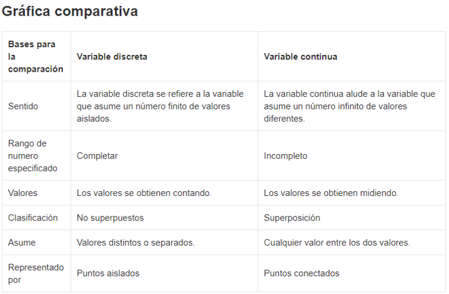

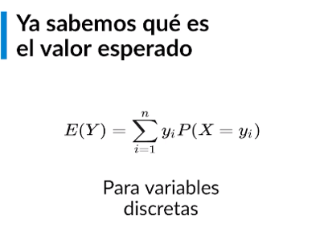

La sumatorio de la probabilidad de cada uno de los valores por el valor en cuestión.

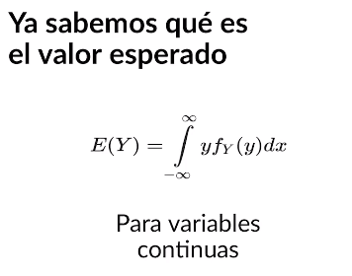

La funcion de densidad de la variable aleatorio acompañada por su valor


El valor esperado condicional es una funcion deterministica de la variable independiente, cuando este cambie el valor esperado de la variable dependiente también va a cambiar.

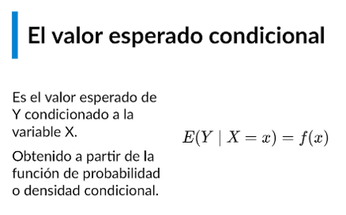

#### Ejemplo Variables Discretas


Para cada nivel académico observamos los diferentes rangos de edad donde podemos encontrar un valor esperado.

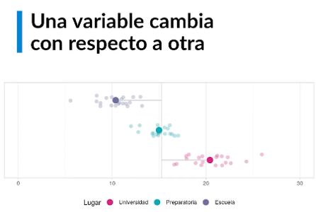

Cambiando la visualización a un Scatter plot e invirtiendo los ejes podemos observar como esta la nube de puntos de los datos y cual es el valor esperado en cada uno de los lugares, y su relación con el valor esperado global de toda la variable de edad.

Esta gráfica nos muestra como cambia el valor esperado de una variable cuando depende de otra variable.

#### Ejemplo variables continuas

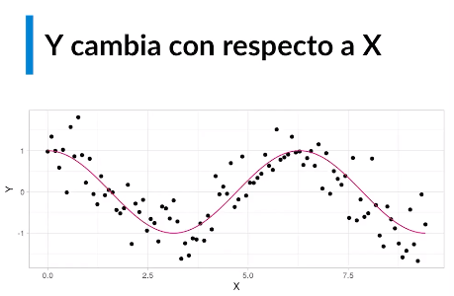

Matemáticamente va cambiando el valor esperado, podemos verlo como una funcion, la cual es una funcion deterministica de x la variable independiente

Esto nos es aplicado a los algoritmos de Machine Learning (Aprendizaje supervisado y no Supervisado)

#### Tipos de Aprendizaje


Todo el aprendizaje supervisado se trata de **valor esperado condicional**


El aprendizaje supervisado se divide en dos tipos:

- **Regresión:** cuando la variable dependiente es continua (a medida que "x" cambia, "y" también lo hace).

- **Clasificación:** cuando la variable dependiente es categórica (discreta), que es cuando en base a caracteristicas de individuos (que se pueden contar) vamos a clasificarlo en alguna de varias categorías.

### Clase 3 Muestras y Poblaciones

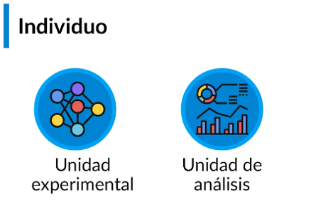

Se el individuo puede dividirse en dos tipos:

- **Unidad experimental:** es aquella de donde obtenemos los datos.
- **Unidad de análisis:** aquella sobre la que queremos realizar nuestros análisis y nuestros conclusiones

Por ejemplo para una prueba de embarazo, la muestra de sangre es la unidad experimental (la que se analizaran sus componentes), mientras la paciente es la unidad de análisis (la persona sobre la que queremos concluir si esta o no embarazada).

**Población:** conjunto enorme de individuos agrupados con caracteristicas comunes.

**Muestra:** subconjunto representativo  de la población.

Porque utilizar muestra? para optimizar costos computacionales o de recursos, o no se cuenta con el tiempo par procesar todos los datos, o sencillamente cuando no se puede realizar el estudio sobre toda la población.


**Muestreo:** Solo con un buen diseño muestral (sin sesgos) es posible obtener conclusiones generalizables.

Un ejemplo de diseño muestral bien realizado.


### Clase 4 Muestreo

En muchas ocasiones cuando debemos analizar una población el análisis de todos los individuos resulta poco costo-efectivo. En estos casos resulta indicado realizar un muestreo. Denominamos muestreo a la selección de un grupo de observaciones (muestra) de una población, con el fin de obtener información. Existen dos tipos de muestreo: **el probabilístico y el no probabilístico**.

Las técnicas de muestreo **probabilísticas se caracterizan por tener una probabilidad conocida y mayor a cero de que cada individuo sea incluido en la muestra.** Esta probabilidad se calcula dependiendo del diseño muestral seleccionado: muestreo aleatorio simple, estratificado, sistemático o por conglomerados, polietápico, entre otros.

En cambio, en las técnicas de muestreo de tipo no probabilístico la selección de los sujetos depende de ciertas características, criterios, u otros factores, que el cliente o investigador considere adecuado. Por lo cual, en términos estadísticos, carecen de validez, confiabilidad y reproducibilidad; debido a que este tipo de muestras no dan certeza que cada sujeto a estudio represente a la población objetivo.

En este curso nos enfocamos en datos secundarios (ya recolectados), que se encuentran generalmente en una base de datos, y por consiguiente el problema del muestreo es mucho menos complejo. Sin embargo, resulta interesante revisar un poco este tema y ver cómo se realiza cuando tenemos datos primarios (por recolectar).

#### Muestreo probabilístico

El **muestreo probabilístico** tiene por objeto estudiar los métodos de selección de muestras representativas de la población con el fin de hacer inferencias sobre la población. La representatividad de una muestra se garantiza por medio de la construcción matemática de la metodología de selección de las unidades experimentales.

---

##### Muestreo aleatorio simple

En el **muestreo aleatorio simple (M.A.S) cada elemento de la población tiene la misma probabilidad de ser seleccionado para la muestra**. Sin embargo, en el muestreo aleatorio simple la selección de observaciones puede ser con repetición o sin repetición. El término **repetición se refiere a que una observación puede ser seleccionada más de una vez**; es decir, no es descartada después de ser seleccionada. Por lo contrario, en el **muestreo sin repetición no se tienen individuos repetidos**, puesto que **una observación no puede ser seleccionada más de una vez**.

---

##### Aleatorio sistematico

Cuando la población está ordenada, ya sea de manera teórica (en una lista) o de manera práctica (en una fila) es posible utilizar el muestreo sistemático. En este tipo de muestreo se recorre la población de manera uniforme y se selecciona cada k-ésimo individuo a partir de un individuo aleatorio escogido entre 1 y k. Para comprenderlo mejor, veamos el método en detalle.

El método de muestreo sistemático se utiliza en muestras ordenadas del 1 al N. Consiste en lo siguiente:

- Se asume que tenemos una población de *N* individuos ordenados del 1 al *N*. Se quiere seleccionar una muestra de tamaño *n*.

Sea *k* el entero más próximo a *N*/*n*.

Se escoge al azar un número *i* entre 1 y *k*.

La muestra será el elemento *i* y los elementos *i* + *k*, *i + 2k*, … hasta terminar. Es decir, el elemento *k* y los elementos a intervalos fijos *k* hasta conseguir los n sujetos:

> M = (i, i+k, i+2k, …, i+(n-1)k)

---

##### Muestreo por conglomerados

El muestreo por conglomerados consiste en que la población está dividida en grupos de manera natural (barrios, regiones, ciudades, etc.) que se caracterizan por ser muy similares entre sí (intercambiables) y muy diversos en su interior (pueblos, ciudades, escuelas). Estos grupos se denominan conglomerados. Entonces en primera instancia seleccionamos aleatoriamente una muestra de conglomerados y posteriormente seleccionamos unidades experimentales de cada conglomerado.

---

##### Muestreo estratificado

Al contrario de los conglomerados, los **estratos son grupos de individuos uniformes en su interior pero muy distintos entre sí (grupos etarios, segmentos de clientes, profesiones)**. Por esta razón es necesario utilizar todos los estratos en el proceso de muestreo. De no hacerlo se ignoraría una parte importante de la población.

Como parte de este muestreo se toma una submuestra a partir de cada estrato mediante un muestreo aleatorio simple, de modo que para obtener la muestra general se combinan las submuestras de todos los estratos.

Suponemos que hay k estratos de tamaños N1, N2, …, Nk, de forma que:

> N = N1 + N2 + … + Nk

En cada estrato se toman n1, n2,…, nk elementos para la muestra, de manera que se toman en total n individuos, es decir:

> n = n1 + n2 + … + nk

**A menudo se toma una razón de muestreo igual para todos los estratos**. Es decir que las unidades en la muestra se asignan entre los estratos y en proporción con el número relativo de unidades en cada estrato de la población. A una muestra seleccionada de esta forma se le denomina **muestra estratificada proporcional**.

---

##### Polietápico

El muestreo **polietápico o en etapas, se recomienda cuando los tamaños de la muestra de los conglomerados o estratos son muy variables, cuando la población resulta muy compleja o cuando el tamaño poblacional es muy grande.** Consiste en realizar varias etapas, cada una con un diseño muestral propio, que puede ser aleatorio simple, por conglomerados o estratificado. En cada etapa se escogen grupos más y más pequeños, hasta llegar a las unidades experimentales.

Este es el diseño muestral más frecuente para encuestas a nivel nacional, por la complejidad de las poblaciones.

---

#### Muestreo no probabilistico

El muestreo no probabilístico se caracteriza por carecer de sustento probabilístico, **por lo cual no es posible garantizar muestras representativas**. No obstante, constituye una poderosa herramienta de recolección de información. Este tipo de muestreo es utilizado en ciencias sociales, en entornos donde las condiciones no permiten el uso de muestreos probabilísticos, o donde la representatividad no resulta relevante.

##### Intencional

La **selección intencional se utiliza en casos donde la población objetivo está constituida por individuos muy poco frecuentes**. En este caso se incluye la mayor cantidad de sujetos sin importar el sistema de selección. Al crear un panel de expertos o examinar una enfermedad extraña es necesario conseguir individuos de análisis cuya aleatorización resulta muy costosa.

---

##### Por conveniencia

La selección de estos casos **se deben a la accesibilidad de la inclusión del elemento y proximidad de este sujeto con el investigador**. Es **útil cuando es necesario disponer de información de manera rápida y poco costosa**, sin importar si es generalizable a la población. **Cuando una persona nos aborda en la calle para llenar una encuesta es muestreo por conveniencia**.

---

##### Muestreo de bola de nieve

El muestreo de bola de nieve **o también conocido como muestreo por referidos se realiza sobre poblaciones en las que no se conoce a sus individuos o es muy difícil acceder a ellos, por lo que cada sujeto estudiado propone a otros, de tal manera que genera un efecto acumulativo de observaciones**. Es ampliamente utilizado en políticas públicas y estudios sociales. **Este es el sistema más frecuente para encontrar información sobre crimen organizado**.

---

##### Muestreo por cuotas

El muestreo de cuotas, **se basa en seleccionar la muestra después de dividir la población en estratos**. Los sujetos dentro de cada grupo son elegidos por métodos no probabilísticos. Además la cantidad de elementos seleccionados se deben a un número arbitrario (cuotas) a partir de los cuales se construye una muestra relativamente proporcional a la población.

---

#### Conclusion

El muestreo es muy importante debido a que estudiar la población en su totalidad no siempre es óptimo. Es necesario que tengamos muy claro que para cada diseño muestral probabilístico existen distintas fórmulas y ecuaciones que determinan los tamaños muéstrales, tanto a nivel de muestra total como de muestras parciales (en cada etapa).

En ese sentido es apropiado investigar los tamaños muéstrales. Por ello el reto de esta clase será buscar una ecuación de tamaño muestral para un tipo de diseño en particular. ¡Recuerda compartirlo en el sistema de comentarios!

### Clase 5 Estimadores y parametros

En las clases anteriores trabajamos el tema de poblacion y muestra, y como obtener información de algunos individuos, pero **¿que informaron quiero obtener a partir de la muestra?** esa es la pregunta a responder...

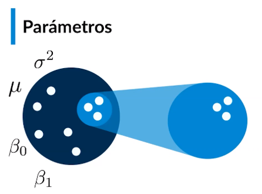

Existen números calculados sobre la poblacion que denominaremos parametros.

- Varianza poblacional (sigma cuadrada)
- Promedio Poblacional (Miu)
- Beta 0 y Beta 1 en el caso de la regresión lineal

Sin embargo nosotros unicamente tenemos acceso a los datos de la muestra, aquí entran en juego los **"Estimadores"** que son números que nos permiten estimar y extrapolar los datos hacia la poblacion.

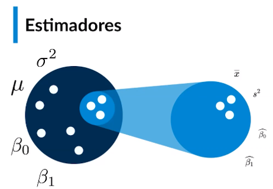

Asi para el promedio poblacional tenemos *x barra*,  para estimar la varianza poblacional tenemos s^2.

Pero en ciencias de datos yo desconozco los datos de la poblacion, por ello se integran "supuestos matemáticos" y se construye un modelo.

Un modelo: Conjunto de supuestos matemáticos sobre la distribución de los datos poblacionales.

En ciencia de datos, la poblacion es el modelo.

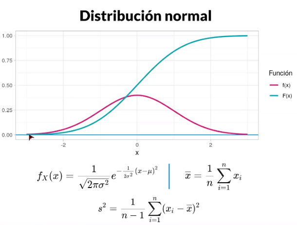

En el caso de una distribución normal f(x) es la curva de densidad, mientras F(x) es la densidad acumulada, debajo observamos la ecuación del modelo, identificamos la varianza poblacional σ^2  y el promedio poblacional μ, también dos formulas adicionales para los estimadores s^2 y x_barra, y los vamos a utilizar para estimar los parametros poblacionales.

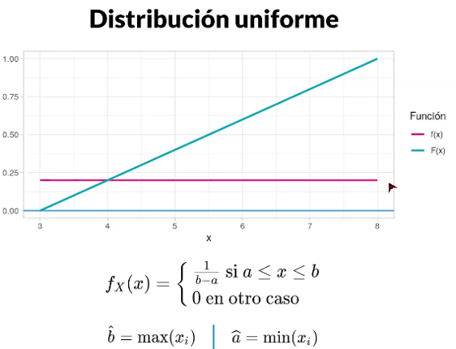

De la misma manera en una distribución uniforme tenemos una funcion de densidad f(x) y una funcion de densidad acumulada, tenemos dos parametros a y b, y los vamos a intentar conocer utilizando nuestra muestra usando los estimadores.

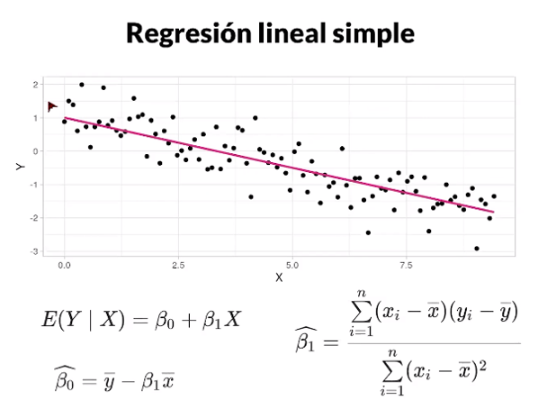

Por ultimo con una regresión lineal simple tenemos nuestra recta de regresión dada por la ecuación (1) del Valor Esperado de  "Y" condicionado a "X"

Conocemos la muestra, pero con los estimadores podemos conocer la información de la poblacion

Conclusion

**La ciencia de datos se encarga de conocer el modelo probabilistico a partir de los datos** utilizando estimadores para aproximar parametros poblacionales.

### Clase 6 Casos parametricos y no parametricos

Cuando estamos estimando un modelo en Ciencia de Datos, hay muchos factores  que debemos tener en cuenta, uno de los mas importantes es si conocemos la distribución de los datos.

En el caso en que **conocemos la distribución de los datos** trabajaremos con el **caso Parametricos**, cuando **no conocemos la distribución** usaremos el **caso no parametricos**.

#### Caso Parametrico


Tendremos una ecuación ya escrita y un numero finito de parámetros x que tenemos que estimar.

Ejemplo 1. Distribución normal tenemos la varianza poblacional σ^2  y el promedio poblacional μ


Ejemplo 2.  Distribución Uniforme tenemos el mínimo poblacional "a" y el máximo poblacional "b"


Ejemplo 3. Regresión Lineal simple tenemos  los parametros B0 y B1


Como podemos darnos cuenta cada uno de estos modelos tiene un numero finito de parametros.

#### Caso No Parametrico


Cuando no sabemos la distribución de los datos.

Este caso esta compuesto por una serie de herramientas que nos va permitir la estimación de parametros que no estan en un espacio  de dimension finita (es raro, suena extraño, pero con ejemplos se entiende mucho mejor)

Ejemplo 1 Estimador Kernel

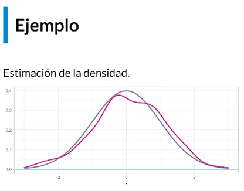

En este caso tenemos el estimador kernel que intenta estimar la densidad

Ejemplo 2 Densidad Acumulada empírica

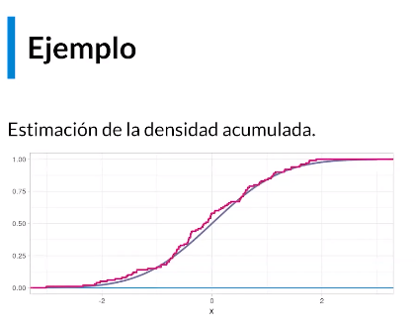

Es un estimador que nos permite aproximar una densidad acumulada, en este caso el estimador es la curva escalonada que se acerca a la curva teórica.

Ejemplo 3 Estimación del valor esperado condicional.


En la gráfica vemos nuestro valor esperado condicional teórico que nunca se conoce en realidad, pero que mediante una estimación no parametrico podemos hacer una aproximación bastante cercana.

Para comprender el paradigma no parametrico hay que comprender antes el parametrico, mientras el parametrico hace uso de los parametros finitos, el no parametrico se va directamente a las funciones que aproximan los comportamientos de los sistemas.

### Clase 7 El espacio de parámetros

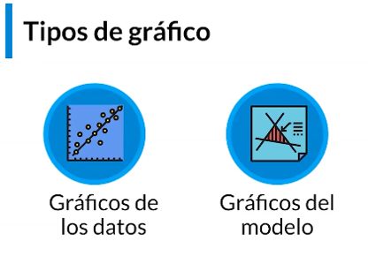

Para comenzar con este tema es necesario dividir en los los gráficos que podemos realizar, los gráficos que nos hablan de los datos, y los que nos hablan de los modelos.

**Gráficos de datos:** Son aquellos que nos permiten mapear los datos y observarlos directamente y a algunas de sus caracteristicas.

A nivel univariado tenemos:

- Histogramas
- Diagramas de densidad
- Boxplots
- Densidad acumulada empírica.

A nivel Multivariado:

- Scatter plots
- Gráficos de densidad (usando una variable categórica, mapeadose esa en colores)
- Boxplots (variable categórica)
- Densidad acumulada empírica.(variable categórica)

Lo que nos interesa ahora son los graficos del modelo.

**Graficos del modelo:** nos permite evaluar el comportamiento de los modelos.

Ejemplo

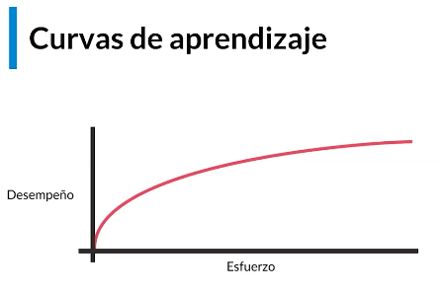

Este nos permite mapear el desempeño en cierta tarea dado un esfuerzo.

#### Espacio de parametros

Es una representacion mediante un plano cartesiano de los parametros de un modelo.

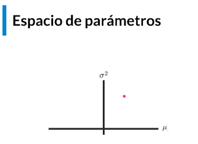

En el caso normal tenemos a M en el eje horizontal y a sigma cuadrado en el eje vertical.

##### Caso distribucion uniforme

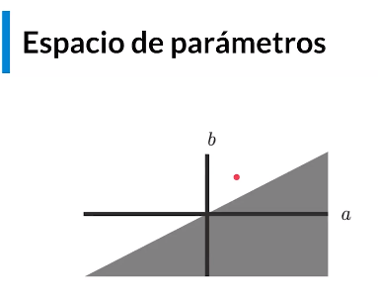

Tenemos la restricción del espacio sombreado donde "b" tiene que ser mayor a  "a" para que el espacio exista

##### Caso Restriccion Lineal

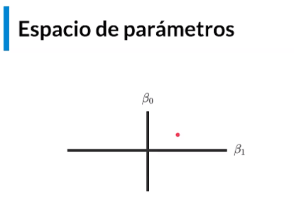

Cada punto de este plano determina una recta de distribucion totalmente diferente.

**Espacio entre parametros** es la representacion mediante un plano cartesiano de los parametros del modelo, en el vamos a poder mapear también las estimaciones que vamos a realizar mediante los datos de la muestra, nos permite entender mejor los conceptos y ver la convergencia.

### Clase 8 Estimacion puntual

Los estimadores puntuales son variables aleatorias, el promedio muestral, la varianza muestral, el máximo  y el  mínimo muestrales son  variables aleatorias porque son calculados a partir de la muestra, ya que dependen de **una muestra aleatoria**.

Estimadores puntuales  tiene los siguientes particularidades:

- Calculados a partir de la muestra.
- Tiene formulas (sumatorias).
- Estan programados en el software.
- Usualmente convergen al parámetro cunando la muestra aumenta.
- Tienen densidad, valor esperado y varianza.

Ejemplo

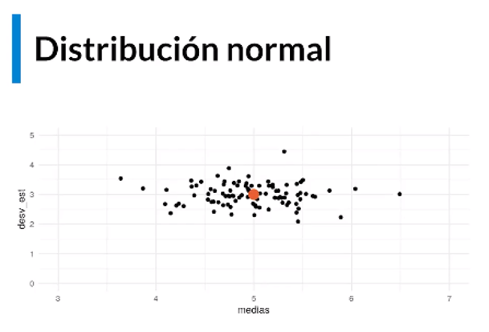

En rojo observamos el parámetro, y los puntos al rededor son estimaciones usando muchas muestras de ese modelo, observamos como no damos exactamente en el parámetro, pero si en un espacio cercano, lo mismo sucede con una distribucion uniforme en la siguiente imagen.

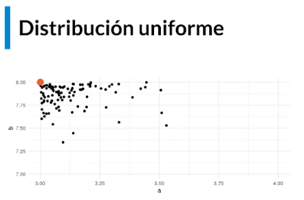

Los estimadores minimo y máximo poblacionales intentan llegar al parámetro, y dependerá del tamaño de la muestra, lo mismo sucede con la regresión lineal.

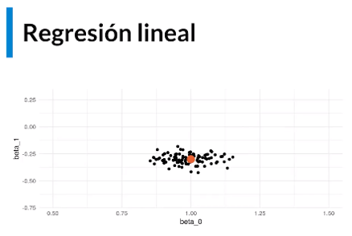

A traves de distintas muestras calculados con estimadores podemos ver todos los puntos negros que van quedando cerca del parámetro, esto nos dice como se comporta la estimacion de mi modelo (regresión lineal, distribucion normal o distribucion uniforme) dependiendo de distintas muestras y como los estimadores siguen siendo variables aleatorias (dependen de la muestra tomada).

### Clase 9 Estimacion por intervalo

Los **intervalos de confianza** son una de las herramientas mas útiles cuando hablamos de estimacion, **consiste en obtener un intervalo con dos umbrales (mínimo y máximo) que encierran al parámetro con una probabilidad del 95%**, en este sentido también son variables aleatorias.

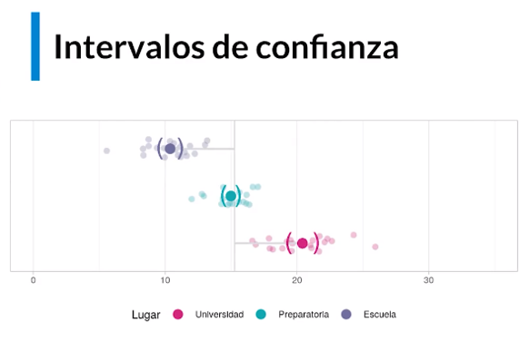

Intervalos de confianza

- Calculados a partir de la muestra
- Tienen formulas (sumatorias)
- Estan programados en el software
- Usualmente convergen al parámetro cuando la muestra aumenta.
- Tienen densidad, valor esperado y varianza.

Ejemplo.

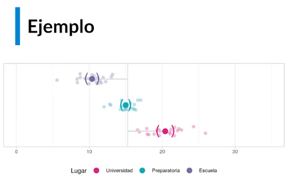

Tenemos el mismo ejemplo del inicio, pero hemos indicado los espacios de confianza **()** al rededor de los datos para cada estimacion, observamos que estos intervalos estan separados de forma tal que puedo observar donde se encuentran mis parametros, aunque podría pasar algo inesperado como en la siguiente figura donde los intervalos de confianza se traslapen entre si y en ese momento yo no sabia cual es mayor o cual es mejor (intervalos morado y verde)

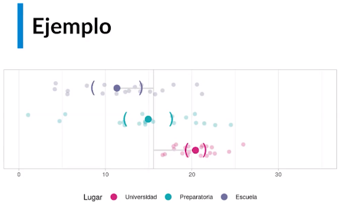

El intervalo salir escuela puede ser 13 y para la preparatoria puede ser 11 y no podría saber que intervalo es mayor y cual es menor, esto significa que los intervalos de confianza para parametros tienen un significado  totalmente distinto cuando estan totalmente separados que  cuando tienen una intersección o estan traslapados.

Como se manifiesta esto en el plano de parametros?

Lo primero es Trazar la recta y=x, esta recta nos permite **diferenciar dos tipos** de parametros, los que son disyuntos (que no se tocan) y los que comparten una region (que se traslapan)

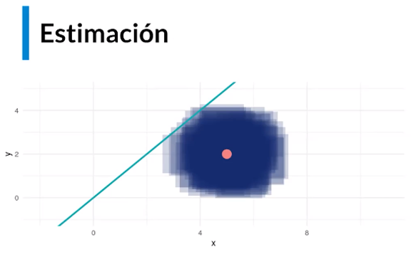

En esta gráfica hay un 100 intervalos de confianza al rededor del parámetro, pero hay unos que tocan la recta y otros que no.

Ejercicio

Toma una hoja y escribe dos intervalos de confianza en el eje horizontal pones el primer intervalo, en el eje vertical pones el segundo intervalo y si al trazar el rectángulo definido por estos dos intervalos este toca la recta es porque los intervalos comparten una region, si el rectángulo no toca la recta, es porque los intervalos son disyuntos.

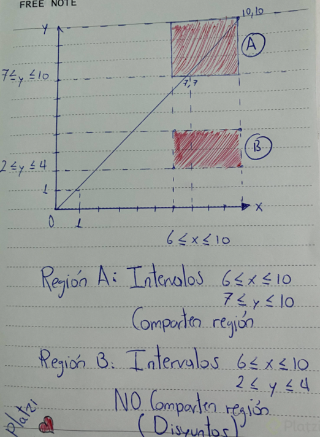

Aporte del estudiante @TUDz en los comentarios de la clase

### Clase 10 Tamaño muestral


Tamaño muestral: es la cantidad de sujetos, individuos o registros en nuestra muestra. Nos sirve para establecer la **convergencia** del estimador hacia el parámetro, un tamaño de muestra mas grande hace que el estimador se acerque mas al parámetro.

Link recomendado <https://seeing-theory.brown.edu/frequentist-inference/index.html#section1>

Esta pagina nos muestra muchos recursos para aprender diversos tópicos de datos, vamos expectation para ver la convergencia.

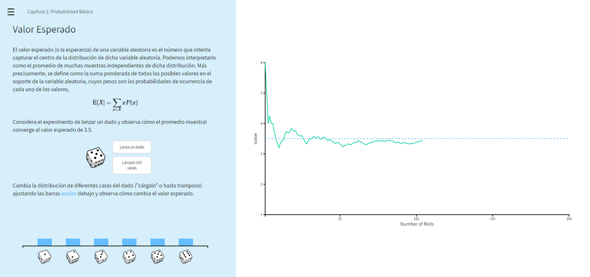

Al lanzar 100 veces  el dado (aumentando el espacio muestral) observamos que el promedio muestral se va acercando al valor esperado, a medida que aumente la cantidad (300 intentos) el promedio muestral y el valor esperado son muy cercanos.

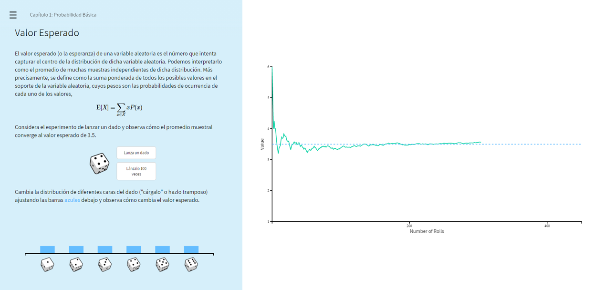

Con ello nos damos cuenta que conforme el espacio muestral aumenta el estimador converge al parámetro, también sucederá con los otros parametros.

Uno de los precursores de la ciencia de datos John W. Tuckey analizo estos casos, fue quien primero hablo del análisis de datos fuera de la estadistica.


Cuando el tamaño de muestra aumenta, los intervalos de confianza disminuyen encerrando mucho mejor al parámetro, y tambien en las pruebas de hipótesis.

Sin embargo no todo es positivo, el tamaño de muestra sigue la ley de los rendimientos decrecientes (mayor esfuerzo el rendimiento es menor)

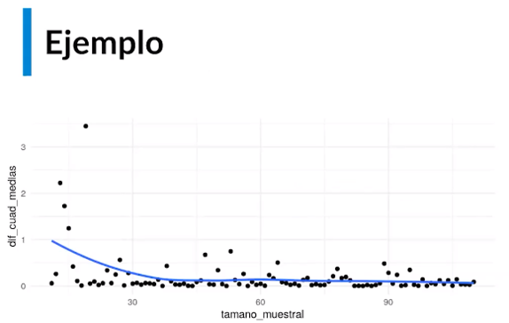

Ejemplo la diferencia entre valor esperado y promedio muestral, de 0 a 30 aumenta mucho la precision y disminuye el error, de 30 a 60 disminuye poco, pero entre 60 y 90 no hay mucha variación para el error.


Lo mismo sucede en el siguiente ejemplo utilizando la desviación estándar

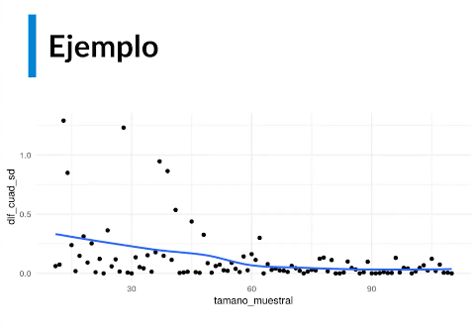

En el tercer ejemplo observamos a Beta 0 para una regresión lineal, tenemos cambios importante de 0 a 30, de 30 a 60  y de 90 en adelante se estabiliza

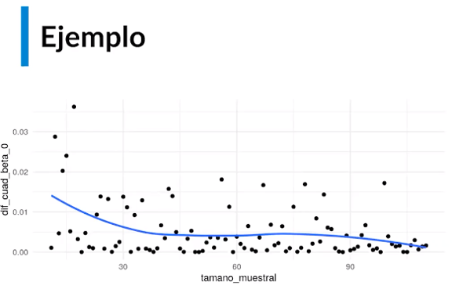

Lo mismo sucede con Beta 1

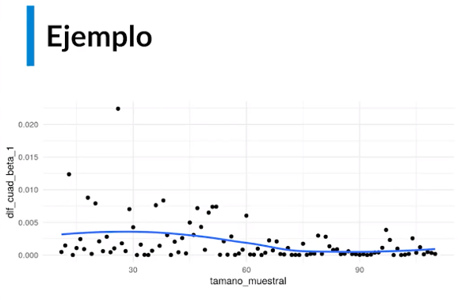

Las observaciones anteriores producen un problema, y **es el objetivo de este curso**  , existe un tamaño muestral después del cual no vale la pena tomar mas registros o introducir mas datos en los modelos dado que tenemos suficientes para la precision buscada.

En resumen el tamaño muestral es la cantidad de observaciones que tengo en la muestra, funciona a partir de la convergencia, tiene propiedades que nos permiten saber que existe un tamaño muestral optimo (la regla de los rendimientos decrecientes).

### Clase 11 Sesgo y varianza

**Exactitud:** es la afirmación verdadera y que puede tener un rango muy grande, habla de la realidad.

**Precision:**  tiene que ver con el rango y debe ser pequeño, y entre menor el rango es mas preciso, en general la precision es falsa, pero siempre es util.

**Cuando no hay exactitud tenemos el problema de sesgo, y cuando no hay precision tenemos el problema de varianza**.

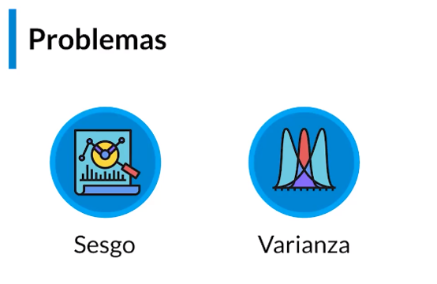

EL Sesgo es un problema en estadistica donde lo que yo afirmo a partir de mis estimaciones es posible que sea falso, mientras que la Varianza consiste en que es posible que la afirmación sea cierta pero el rango que yo estoy utilizando para mis intervalos de confianza es tan grande que probablemente sea inútil.

#### Sesgo

**Sesgo:** es la diferencia entre el valor esperado del estimador (lo que afirmo) y el parámetro (lo que es real).

El estimador es una variable aleatoria, por lo tanto tiene un valor esperado.


**Estimador insesgado:** Si el valor esperado del estimador es exactamente igual al parámetro, este se denomina un estimador insesgado. ejemplos el promedio, desviación estándar muestral, varianza muestral.

#### Varianza

Varianza: el estimador es una variable aleatoria, por lo tanto tiene varianza. Esta varianza queremos sea pequeña, esto se puede hacer aumentando el tamaño de muestra, estimadores distintos tienen varianzas diferentes.


Un estimador que tiene la varianza más pequeña que todos los demás se denomina un estimador de **mínima varianza**.

Los mejores estimadores serán por lo tanto los insesgados y los de minima varianza


Sin embargo ambos conceptos son enemigos, ya que existe la medida **Error Cuadrático Medio (Mean Squared Error) o MSE**, el cual generalmente se mantiene constante, este es la suma del sesgo al cuadrado mas la varianza,  esto quiere decir que conforme el sesgo aumenta, la varianza disminuye y viceversa.

Lo clave.

- Exactitud tiene que ver con el sesgo.
- Precision tiene que ver son varianza.
- Hay estimadores insesgados
- Hay estimadores de minima varianza
- Hay estimadores insesgados de minima varianza

### Clase 12 Teoría no parametrica

Repaso: Conocemos la teoria parametrica, que consiste en el estimador, el parámetro y como convergen estos a medida que la muestra poblacional aumenta.

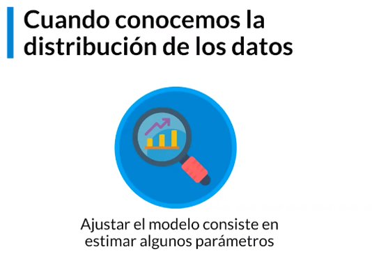

Cuando no conocemos la distribucion de los datos nos permite usar la metodologia parametrica.


Podemos suponer que es una distribucion normal, sin embargo eso no siempre es suficiente.


Debemos indagar nuevos métodos que nos permitan hacer la estimacion sin necesidad de conocer la distribucion, se llaman **métodos no parametricos** consisten en lo siguiente:

- Estiman parametros de dimension infinita.
- Esto es, **estiman funciones**.
- estimadores hacen uso de información ilimitada.
- Pueden ser utilizados en muchos mas escenarios
- Muchos de ellos pueden trabajar con variables categóricas ordinales.

Hay un modelo en particular la **red neuronal** este es un modelo parametrico tiene una cantidad finita de parametros, (un modelo que estima una curva directamente sin una cantidad definida de parametros es no parametrico), y es una especie de modelo híbrido ya que al tener muchísimos parametros comienza a comportarse como un modelo no parametrico.

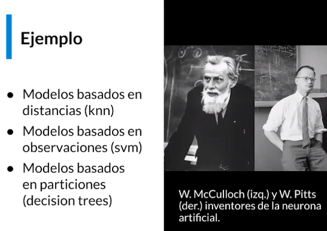

Los procesos de inferencia para los modelos no parametricos son distintos a los que hemos visto

### Clase 13 Estimacion funcional: una sola variable

El espacio de parametros que hemos utilizado hasta este punto nos permite tener dos parametros (x,y).

La estadistica no parametrica tiene estimadores que viven vectorial de dimension infinita, y estos son espacios de funciones.

Que funciones quiero estimar?

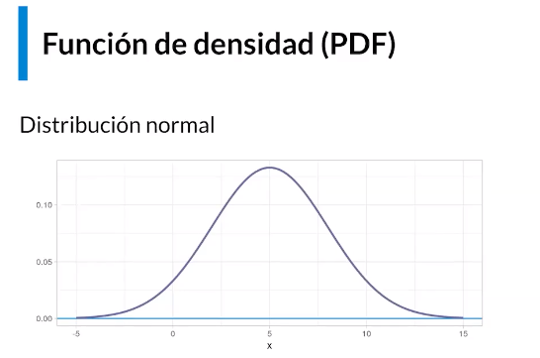

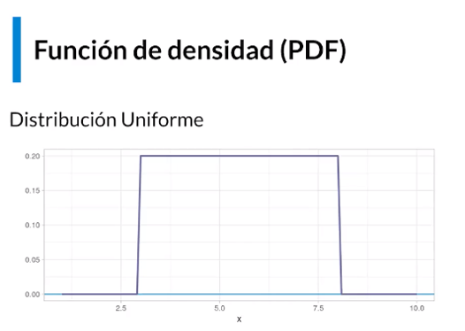

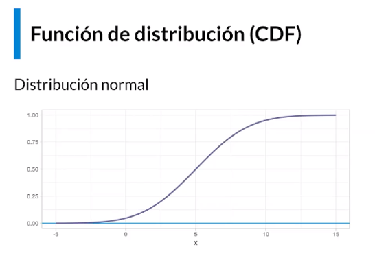

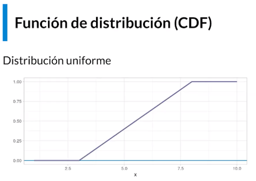

Nota: las funciones de acumulación de densidad son las integrales de las funciones de densidad. (1 corresponde 3) y (2 corresponde a 4).

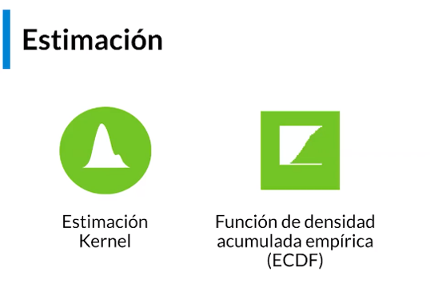

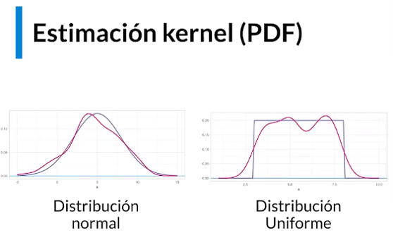

Una distribucion kernel es la aproximación de la distribucion normal (linea roja), sin embargo para la distribucion uniforme al realizar la estimacion kernel no queda tan bien.

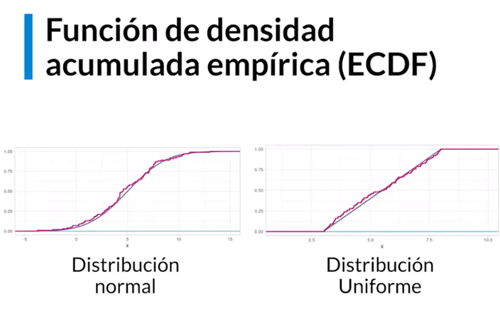

Vemos como se aproxima muy bien como se aproxima a ambos casos.

En este [link](https://towardsdatascience.com/what-why-and-how-to-read-empirical-cdf-123e2b922480) encontraras un articulo sobre como leer estas curvas y como realizar análisis EDA con ellas.

### Clase 14 Estimación funcional: valor esperado condicional

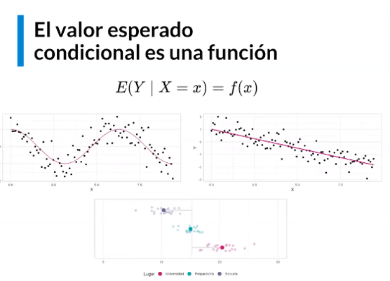

Como vimos antes el **valor esperado condicional una funcion de la variable independiente**, puede ser una funcion no lineal, o una funcion lineal o en el caso de que la variable independiente sea categórica tendremos distritos valores esperados para distintas categorías.

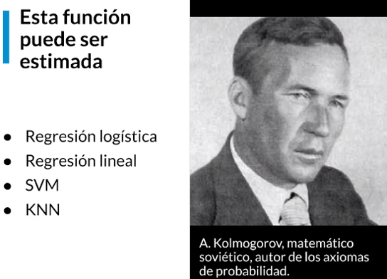

Kolmogorov fue quien hizo los axiomas de la probabilidad (organizo y axiomatizo toda la teoria de la probabilidad).

Retomando, el valor esperado condicional puede ser calculado

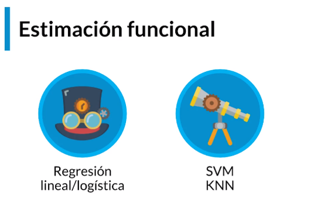

*SVM: maquinas de soporte vectorial

Los primeros dos pueden ser calculados, ya que cada uno tiene parametros finitos y cada uno tiene sus estimadores.

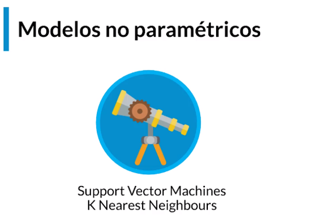

Los segundos no tienen ese tipo de formulas, son procedimientos mas algorítmicos que nos van a permitir una aproximación del valor esperado condicional.

### Clase 15 Bootstrapping

**Bootstrapping:** es una herramienta no parametrica para hacer inferencia. Funciona bien para inferencias cuando los modelos **parametricos** cuando tenemos dudas respecto a los supuestos distribucionales de los mismos.


Lo que hago es obtener una muestra aleatoria, y de esa muestra tomo mas muestras aleatorias, y básicamente la intención es obtener muchas muestras aleatorias pequeñas que nos permitan obtener de cada una un estimador, y al final obtener un conjunto de estimadores, este conjunto me va a permitir hacer intervalos de confianza y generar estimaciones mas robustas.

Por ejemplo

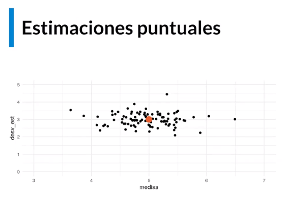

Observamos el parámetro en naranja, medida 5 y desviación estándar 3, luego para cada muestra puedo obtener tambien sus medias y su desviación estándar, y obtener una nube de puntos alrededor de mi parámetro para después obtener intervalos de confianza tambien al rededor del parámetro utilizando las funciones de quartile desde un 5% hasta un 95% para obtener un intervalo del 90% de confianza o desde 2.5% hasta 97.5% para obtener un intervalo de 95% de confianza,  ese es el funcionamiento del Bootstraing, obtener muchas repeticiones, de muchas estimaciones a partir de remuestreo.

 Bootstrapping

- Una muestra aleatoria de una muestra aleatoria es una muestra aleatoria.
- Las estimaciones de submuestras son una muestra aleatoria del estimador.
- Es posible usar esta muestra para tener un intervalo de confianza.

Este método resulta particularmente **util cuando un modelo parametrico no cumple los supuestos.**

### Clase 16 Validacion cruzada

Es el segundo método mas usado para obtener inferencias.


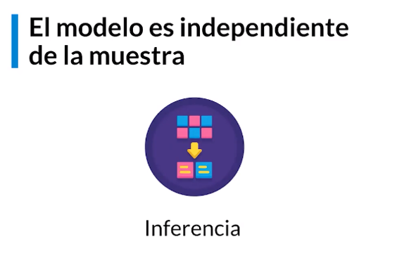

Lo que queremos demostrar es que el modelo sea independiente de la muestra, si yo tomo una muestra aleatoria esta sea independiente al modelo y se pueda generalizar a la población independientemente de cual muestra se tomo.


Cuando pruebo una muestra distinta en el modelo y funciona puedo decir que el modelo no depende de la muestra, cuando esto se cumple el modelo es generalizable.

#### Validacion cruzada de pliegues

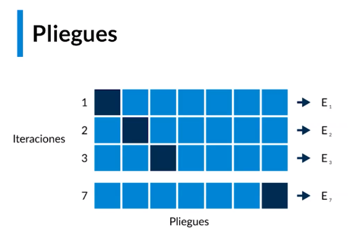

Tomamos una muestra muy grande, y la dividimos en 7 partes (7 pliegues), funciona asi:

Primera iteración tomo 6 de estos para entrenamiento y 1 pliegue para test, entreno mi modelo y lo pruebo con el set de test, miro cual es el error, lo anoto, Segunda iteración, utilizo el segundo conjunto de datos para train, y el resto para test, y asi hasta llegar a la iteración 7, al final tendremos 7 estimaciones del error por fuera de nuestro conjunto de datos de prueba, estas estimaciones si yo las resumo permiten encontrar cual es el error general del modelo, y darme cuenta si el modelo sirve independientemente de los datos en los que es entrenado.

Este abordaje por su sencillez es el mas usado en ciencias de datos (modelos parametricos, no parametricos, ml, etc).

EL método de validacion cruzada consiste en usar unos datos para entrenar el modelo y otros datos para comprobar el modelo. set de entrenamiento y set de prueba.

Validacion de pliegues usa un conjunto de datos segmentados y se turnan en ser los datos de train y test.

### Clase 17 Introduccion a las pruebas de hipótesis

Una **prueba de hipótesis** o también denominada **prueba de significación** tiene como **objetivo principal evaluar y justificar suposiciones o afirmaciones acerca de los valores estadísticos de la población (parámetros)**. De modo que resulta muy importante para la toma de decisiones estadísticas frente a la caracterización del estudio, no sin antes plantear las posibles características de la población. En otras palabras, una prueba de hipótesis permite establecer la veracidad de planteamientos hipotéticos en una población a partir de información de una muestra aleatoria.

Este tema debes haberlo visto antes de este curso. Sin embargo, nunca es un mal momento para revisarlo.

#### Historia breve

Inicialmente la historia de las pruebas de hipótesis no ha estado exenta de controversias y desacuerdos desde su origen, factor que ha conducido a diversas dificultades para su aplicación e interpretación. De todas formas los artículos que plasman los elementos lógicos se dieron a principios del siglo XVII, entre las décadas de 1920 y 1930 como resultado de dos fuentes de pensamiento en donde por un lado está Ronald Fischer (1890-1962) y por el otro está Jerzy Neyman (1894-1981) en compañía de Egon Pearson (1895-1980).

De acuerdo al enfoque de **Fischer**, la **prueba de hipótesis se caracteriza únicamente por una hipótesis conocida como hipótesis nula y con base al estadístico de prueba se estima la probabilidad de una muestra de datos para decidir sobre el rechazo o no del supuesto o hipótesis. Los datos solo permiten rechazar la hipótesis pero no puede ser confirmada**. Sin embargo, para Neyman-Pearson y el enfoque propuesto se adiciona una hipótesis alternativa que se contrapone a la hipótesis nula y orienta a la definición de regiones (de rechazo y no rechazo). Otro anexo son los errores asociados a la hipótesis nula, tales como los errores tipo I y tipo II. Posteriormente la integración de los dos modelos por parte de estadísticos, investigadores y autores de libros de texto se hizo práctica común desde 1935.

#### Objetivo de una prueba de hipotesis

Como se mencionó, el objetivo de una prueba de hipótesis es establecer la veracidad de planteamientos hipotéticos en una población a partir de información de una muestra aleatoria. Para esto es necesario recorrer un camino que convertirá nuestra hipótesis en verdadera. Este camino está compuesto por varios personajes, que son:

- La hipótesis nula

- La hipótesis alterna

- El estadístico de prueba

- La región de rechazo

- El p-valor

- El error tipo I

- El error tipo II

- La significancia alpha

- La potencia 1 - beta

#### Sistema de hipotesis

El sistema de hipótesis está conformado por una hipótesis **nula** y una **hipótesis alterna** denotadas por **H0** y **Ha** respectivamente. **Cada hipótesis es una afirmación que puede ser falsa o verdadera**. Más específicamente estas afirmaciones se refieren a la pertenencia del parámetro a un conjunto específico. En general un sistema de hipótesis debe lucir así:

> H0 : θ ∈ Ω0
> Ha : θ ∈ Ωa

Siendo θ el parámetro y el conjunto nulo Ω0 un subconjunto del espacio de parámetros disjunto del conjunto alterno Ωa.

Entonces, una prueba de hipótesis se trata de determinar cuál de las dos hipótesis mostradas es verdadera tomando en consideración la información proveniente de la muestra.

Es posible tomar como ejemplo el sistema de hipótesis de igualdad de medias. Nos damos cuenta allí que la hipótesis nula utiliza el subconjunto Ω0 = {μ0} mientras la hipótesis alterna hace uso de su complemento.

> H0 : μ = μ0
> Ha : μ ≠ μ1

Sin embargo esta no es la única configuración admisible. La hipótesis alterna puede ser distinta:

> Ha : μ > μ0
> Ha : μ < μ0

Tomando distintos conjuntos alternos Ωa. Sin embargo, **no es posible tomar distintas hipótesis nulas**.

Esto sucede porque cada prueba de hipótesis tiene un estadístico denominado el estadístico de la prueba, de manera que cuando la hipótesis nula es verdadera, la distribución del estadístico de la prueba es conocida. Al cambiar la hipótesis nula, este conocimiento se pierde, es decir, el funcionamiento del estadístico de la prueba no es el mismo.

#### Errores tipo I y II

El **error tipo I ocurre al rechazar H0 dado que H0 es cierta**, y **su probabilidad se representa por α**, que se conoce como **nivel de significancia**. El **error tipo II ocurre al no rechazar H0 dado que H0 es falsa,** y su probabilidad **se representa por β cuya transformación 1 - β** se conoce como la **potencia de la prueba**.


#### Estadistico de la prueba y region critica

Como se mencionó, **cada prueba de hipótesis tiene un estadístico T denominado el estadístico de la prueba cuya distribución (distribución nula) es conocida cuando la hipótesis nula es verdadera F0** . Sin embargo, cuando la hipótesis nula es falsa la distribución de este estadístico resulta desconocida, solo sabemos que es lejana de la distribución nula.

El procedimiento consiste en calcular el valor de este estadístico T a partir de la muestra y compararlo con la distribución nula F0. Para realizar esta comparación los estadísticos solían utilizar un concepto denominado región crítica.

La región crítica es un intervalo definido con una probabilidad α sobre la distribución nula F0. De manera que si el estadístico de la prueba T pertenece a esta región, entonces es muy probable (1 - α) que la hipótesis nula H0 sea falsa. Y en este caso la decisión a tomar sea rechazarla.

Estas regiones críticas cambian dependiendo del conjunto alterno Ωa. Cuando existe la posibilidad de que haya valores de mayor, menor o igual, el estadístico de prueba se comporta de manera distinta y por ende las regiones críticas también. Para el ejemplo de la prueba de hipótesis sobre la media puede verse así:


**Región crítica para cola izquierda**, cuando la hipótesis alterna es Ha : μ < μ0


**Región crítica para cola derecha**, cuando la hipótesis alterna es Ha : μ > μ0


**Región crítica para dos colas**, cuando la hipótesis alterna es Ha : μ ≠ μ0

No obstante, estos conceptos han caído en desuso debido a la estandarización de las pruebas de hipótesis con el uso de los valores p.

#### p-valores

La definición de los p-valores es más compleja. **Un p-valor tiene distintas definiciones dependiendo del caso que contempla el sistema de hipótesis**, así:

Para el caso de **cola izquierda** un p-valor se calcula como el **área bajo la curva menor al estadístico de la prueba**. En este caso, p = F0(T).

Para el caso de **cola derecha** un p-valor se calcula como el **área bajo la curva mayor al estadístico de la prueba**. En este caso, p = 1 - F0(T).

Para el caso de **dos colas** un p-valor **se calcula como dos veces el mínimo entre las áreas bajo la curva menor y mayor al estadístico de la prueba**. En este caso p = 2 * min(F0(T), 1 - F0(T)).

De aquí se deduce que, **al ser una función de una variable aleatoria, el p-valor es una variable aleatoria**. **La distribución** de esta variable aleatoria es **uniforme cuando la hipótesis nula es cierta**.

#### Significancia α y potencia 1 - β

La **probabilidad de error tipo I** se denomina **α o nivel de significancia**. Dado que la distribución del estadístico de la prueba es conocida es posible determinar de antemano la probabilidad de error tipo I que vamos a asumir. Entonces, **el nivel de significancia α se fija previo a la prueba**.

Hay que tener en consideración que **cuando la probabilidad de error tipo I disminuye, la probabilidad de error tipo II aumenta**. Al especificar un α igual a cero esperaríamos que la probabilidad de error tipo I fuera nula, permitiendo un análisis óptimo sin este error. Sin embargo, lo que sucede en realidad con un α igual a cero es que nunca se rechaza la hipótesis nula H0. En este escenario las posibilidades son únicamente decisión correcta o error tipo II, aumentando la probabilidad de error tipo II. Esto lo puedes ver mejor en la tabla de arriba.

En el abordaje tradicional permite a su vez delimitar las regiones de rechazo y no rechazo de la hipótesis nula. Un α grande presenta regiones de rechazo mayores que un α cercano a cero.

Sin embargo, estos conceptos se simplifican al introducir el uso de p-valores. Puesto que al ser un p-valor una variable aleatoria uniforme bajo H0 es posible ver dos cosas:

**La probabilidad de que siendo cierta H0 el valor p sea menor que α es α (error tipo I)**.

Siendo cierta Ha la probabilidad de que el valor p sea menor que α es alta (aunque no se tiene un valor, pues depende del tamaño de la muestra y de los parámetros) y se denomina potencia 1 - β.

La potencia de una prueba de hipótesis, entonces, es la probabilidad de que una prueba rechace correctamente la hipótesis nula cuando esta es falsa, es decir 1 - β. La potencia de una prueba de hipótesis es **distinta según el problema que se aborda, depende además del tamaño de la muestra, los parámetros y el nivel de significancia establecida**.

Una forma de medir la potencia de una prueba es ejecutarla varias veces sobre conjuntos de datos simulados a partir de un modelo donde la hipótesis nula es falsa y analizar la proporción de rechazos.

#### Conclusion sobre las pruebas de hipotesis

Las pruebas de hipótesis son **herramientas estadísticas para conocer la población a partir de la información de la muestra**, es importante que tengan resultados significativos pues de lo contrario la hipótesis no es poblacional sino solo muestral y no hay inferencia. Casi todas las preguntas que podemos hacerle a unos datos tienen una prueba de hipótesis asociada. Diferencia de medias entre dos, tres o más grupos, correlación, normalidad, homocedasticidad y muchas otras.

### Clase 18 Pruebas de hipótesis

- Las pruebas de hipotesis estan estandarizadas.
- El producto de una prueba de hipotesis es un p-valor.

#### Significancia

- EL p-valor es una variable aleatoria
- Cuando la hipotesis nula se cumple el p-valor tiene una distribucion uniforme.
- Con un umbral alfa de 0.05 podemos saber si la hipotesis alterna es cierta en la poblacion, o solo en la muestra. Es decir el p-valor nos va a permitir saber cuando es menor que el umbral como podemos generalizar nuestro conocimiento de la muestra hacia la poblacion (esto se llama significancia).
- **El objetivo es hacer inferencia de la hipotesis**
- Cuando existe la inferencia se llama "**estadisticamente significativo**"
  
Esto ha sido complicado, pero no imposible

**No es posible afirmar nada sobre la poblacion cuando los resultados de la prueba de hipotesis no son estadisticamente significativos**.

De esto tratan las pruebas de hipotesis, de la estandarizacion, el p-valor y la significancia.

## Modulo 2 Simulacion

### Clase 19 Teorias formales

En este modulo hacemos un repaso de los conceptos teóricos del modulo anterior haciendo simulacion a manera de practica.

**La forma es mas importante que el fondo**.

1.- Lógica: si sigues esos pasos todo resulta ser cierto. (Aristoteles y Leibniz)

2.- Experimentos (galileo y Descartes), no importa si lo que dices es lógico, pero si no tienes un experimento que lo compruebe entonces no es cierto .

3.- Falsabilidad (david hume: se enfoca en la comprobación por medio de hechos, Karl Poppe, Tomas Kuhn)

4.- Emile Durkhem precursor del análisis de datos en ciencias sociales, jhon Snow bases teóricas para epidemologia precursor de análisis de datos en ciencias de la salud, Francis Galton implemento análisis de datos en antropometria, psicometria y genética.

>Si tu experimento necesita estadistica, hubiera sido mejor hacer otro experimento. Ernest Ruthenford

En este momento la ciencia de datos es una forma científica.

### Clase 20 Instalación de R

instalación general windows/mac/ubuntu

No requieres detalles si has llegado hasta este punto.

[Enlace R](https://cran.r-project.org/)

[Enlace RStudio](https://rstudio.com/products/rstudio/download/#download)

### Clase 21 Explorando datos simulados

En esta clase simulamos lo siguiente:

- Distribucion Uniforme
- Distribucion No Uniforme
- Modelo lineal
- Modelo No lineal

Datos simulados


```R
# Vamos a jugar con datos simulados. Escojan sus

# Distribucion normal estándar
y <- rnorm(100)
plot(density(y))

# Distribucion normal de media cinco y desviación estándar 3
y <- rnorm(100,5,3)
plot(density(y))

# Distribucion uniforme 0,1
y <- runif(100)
plot(density(y))

# Distribucion uniforme a=3, b=8
y <- runif(100,3,8)
plot(density(y))
```


```R
# Ejemplo de la edad y el lugar

data.frame(
  Edad = rnorm(50, 10, 1.2),
  Lugar = "Escuela"
) -> escuela

data.frame(
  Edad = rnorm(45, 15, 1.9),
  Lugar = "Preparatoria"
) -> prepa

data.frame(
  Edad = rnorm(80, 21, 2.5),
  Lugar = "Universidad"
) -> universidad

rbind(escuela, prepa, universidad) -> edad_lugar

boxplot(Edad ~ Lugar, data = edad_lugar)
```


```R
# Modelo lineal

X <-seq(0, 3*pi, length.out = 100)
Y <- -0.3*X + 1 + rnorm(100,0,0.5)
Z <- -0.3*X + 1

data.frame(X,Y,Z) -> datos_lineal
plot(Y ~ X, data = datos_lineal )
lines(Z ~ X, data = datos_lineal, col = 2, lwd = 2)

```


```R
# Modelo no lineal
X <-seq(0, 3*pi, length.out = 100)
Y <- cos(x) + rnorm(100,0,0.5)
Z <- cos(x)

data.frame(X,Y,Z) -> datos_no_lineal
plot(Y ~ X, data = datos_no_lineal )
lines(Z ~ X, data = datos_no_lineal, col = 2, lwd = 2)
```

### Clase 22 Simulando estimadores puntuales

En esta clase realizamos procesos de estimacion de parametros utilizando datos simulados.

La simulacion nos permite tener parametros conocidos, en la vida real nunca es posible conocer el parámetro.


```r
tamano_muestral <- 35
iteraciones <- 100

medias <- vector()
desv_est <- vector()

media_poblacional <- 3
desv_est_poblacional <- 5

for(i in seq_len(iteraciones)){
  muestra <- rnorm(tamano_muestral, media_poblacional, desv_est_poblacional)
  medias[i] <- mean(muestra)
  desv_est[i] <- sd(muestra)
}

plot(medias, desv_est)
points(media_poblacional, desv_est_poblacional, col = 2, cex = 2, pch = 20)
```


```r

tamano_muestral <- 35
iteraciones <- 100


beta_0 <- 1
beta_1 <- -0.3

beta_0_estimado <- vector()
beta_1_estimado <- vector()

genera_y <- function(x, beta_0, beta_1){
  beta_1*x + beta_0 + rnorm(length(x), 0, 0.5)
}

for(i in seq_len(iteraciones)){
  X <- seq(-3, 3, length.out = tamano_muestral)
  Y <- genera_y(X, beta_0, beta_1)
  betas_estimados <- coef(lm(Y ~ X))
  #lm funcion linear model de R
  beta_0_estimado[i] <- betas_estimados[1]
  beta_1_estimado[i] <- betas_estimados[2]
}

plot(beta_0_estimado, beta_1_estimado)
points(beta_0, beta_1, col = 2, cex = 2, pch = 20)
```

### Clase 23 Simulando intervalos de confianza

Ya simulamos procesos de estimacion puntual, ahora vamos a simular procesos de estimacion por intervalo.

Tendremos 2 poblaciones distribuidas normalmente con medias distintas, cada una de estas le pondremos un intervalo de confianza para que sean distintas realmente en la poblacion los intervalos no deberían traslaparse, lo comprobamos utilizando rectángulos y la recta x=y


```R

# En el espacio de parámetros podemos ver los parámetros y los int --------

# intervalos de confianza de la media -------------------------------------

tamano_muestral <- 35
iteraciones <- 100
media_poblacional_A <- 5
media_poblacional_B <- 3
desv_est_poblacional <- 2

plot(media_poblacional_A, media_poblacional_B)

for(i in seq_len(iteraciones)){
  #obtengo la muestra de A
  muestra_A <- rnorm(tamano_muestral, media_poblacional_A, desv_est_poblacional)
  # Aplico funcion t de student que obtiene datos sobre la media
  t_test_A <- t.test(muestra_A)
  # Cambio el intervalo de confianza de A
  intervalo_A <- t_test_A$conf.int
  # Obtengo limites del intervalo
  LI_A <- min(intervalo_A)
  LS_A <- max(intervalo_A)
  
  # Obtengo la muestra de B
  muestra_B <- rnorm(tamano_muestral, media_poblacional_B, desv_est_poblacional)
  t_test_B <- t.test(muestra_B)
  intervalo_B <- t_test_B$conf.int
  LI_B <- min(intervalo_B)
  LS_B <- max(intervalo_B)
  
  # Creo un rectángulo con los limites de A y B
  rect(LI_A, LI_B, LS_A, LS_B)
  
}

abline(0,1, col = 2)
points(media_poblacional_A, media_poblacional_B, col = 4, pch = 20, cex = 3)
```

### Clase 24 Observando el comportamiento del tamaño muestral

Durante el curso hemos hablado de las propiedades del tamaño muestral y de como interviene en la convergencia, esta clase lo simula en R


Observa  cambiando los parametros del tamaño de muestra (usa 5000) y el numero de iteraciones.

Este es el comportamiento del tamaño muestral, se trata de la convergencia de los estimadores hacia los parametros, sin embargo podemos ver que esta convergencia no siempre es igual, al principio convergen muy fuerte pero luego se estabilizan un poco, lo que hace que haya **tamaños muestrales óptimos** para cada uno de los modelos que tenemos que estimar.

```r

# Podemos ver que el tamaño muestral presenta rendimientos decreci --------


# Distribución normal -----------------------------------------------------

tamano_muestral_max <- 500
iteraciones <- 100
media_poblacional <- 5
desv_est_poblacional <- 3
tamano_muestral <- floor(seq(10, tamano_muestral_max, length.out = iteraciones))

#inicializa vectores
desv_est_estimada <- media_estimada <- dif_cuad_media <- dif_cuad_desv_est <- vector()

for (i in seq_len(iteraciones)) {
  muestra <- rnorm(tamano_muestral[i], media_poblacional, desv_est_poblacional)
  media_estimada[i] <- mean(muestra)
  desv_est_estimada[i] <- sd(muestra)
  dif_cuad_media[i] <- (media_estimada[i] - media_poblacional)^2
  dif_cuad_desv_est[i] <- (desv_est_estimada[i] - desv_est_poblacional)^2
}


# Graficamos par la media_estimada vs tamano_muestral
plot(media_estimada ~ tamano_muestral)
abline(h = media_poblacional, col = 2, lwd = 2)
# El estimador converge al parámetro a medida que la media poblacional aumenta

plot(dif_cuad_media ~ tamano_muestral, type = "l")
# El desempeño del estimador aumenta al aumentar tamaño muestral


# Graficamos par la desv_est_estimada vs tamano_muestral
plot(desv_est_estimada ~ tamano_muestral)
abline(h = desv_est_poblacional, col = 2, lwd = 2)

plot(dif_cuad_desv_est ~ tamano_muestral, type = "l")


## Código adicional
# Distribución uniforme ---------------------------------------------------


tamano_muestral_max <- 500
iteraciones <- 100
maximo_poblacional <- 8
minimo_poblacional <- 3
tamano_muestral <- floor(seq(10, tamano_muestral_max, length.out = iteraciones))

maximo_estimado <- minimo_estimado <- dif_cuad_maximo <- dif_cuad_minimo <- vector()

for (i in seq_len(iteraciones)) {
  muestra <- runif(tamano_muestral[i], minimo_poblacional, maximo_poblacional)
  maximo_estimado[i] <- max(muestra)
  minimo_estimado[i] <- min(muestra)
  dif_cuad_maximo[i] <- (maximo_estimado[i] - maximo_poblacional)^2
  dif_cuad_minimo[i] <- (minimo_estimado[i] - minimo_poblacional)^2
}


plot(maximo_estimado ~ tamano_muestral)
abline(h = maximo_poblacional, col = 2, lwd = 2)

plot(dif_cuad_media ~ tamano_muestral, type = "l")


plot(minimo_estimado ~ tamano_muestral)
abline(h = minimo_poblacional, col = 2, lwd = 2)

plot(dif_cuad_desv_est ~ tamano_muestral, type = "l")


# Regresión lineal --------------------------------------------------------

tamano_muestral_max <- 500
iteraciones <- 100
beta_0 <- 1
beta_1 <- -0.3
minimo_poblacional <- 3
tamano_muestral <- floor(seq(10, tamano_muestral_max, length.out = iteraciones))

genera_x <- function(n) seq(-3, 3, length.out = n)

genera_y <- function(x, beta_0, beta_1){
  beta_1*x + beta_0 + rnorm(length(x), 0, 0.5)
}

beta_0_estimado <- beta_1_estimado <- dif_cuad_beta_0 <- dif_cuad_beta_1 <- vector()

for (i in seq_len(iteraciones)) {
  X <- genera_x(tamano_muestral[i])
  Y <- genera_y(X, beta_0, beta_1)
  betas <- coef(lm(Y ~ X))
  beta_0_estimado[i] <- betas[1]
  beta_1_estimado[i] <- betas[2]
  dif_cuad_beta_0[i] = (beta_0_estimado[i] - beta_0)^2
  dif_cuad_beta_1[i] = (beta_1_estimado[i] - beta_1)^2
}


plot(beta_0_estimado ~ tamano_muestral)
abline(h = beta_0, col = 2, lwd = 2)

plot(dif_cuad_beta_0 ~ tamano_muestral, type = "l")


plot(beta_1_estimado ~ tamano_muestral)
abline(h = beta_1, col = 2, lwd = 2)

plot(dif_cuad_beta_1 ~ tamano_muestral, type = "l")


```

### Clase 25 Estimando distribuciones simuladas

Los procesos de estimacion existen a nivel puntual y a nivel funcional, ya vimos como los estimadores a nivel puntual y a nivel de intervalo convergen a medida que la muestra aumenta, veamos que sucede con los estimadores de funciones.

Usaremos distribucion Kernel para estimar la distribuciones de unos datos uniformes


Aumentamos el numero de muestras a 7000


Observamos que a pesar del numero de muestras el estimador no se acerca al parámetro, por lo que este estimador es de tipo sesgado.

```R
# Distribución uniforme ---------------------------------------------------


tamano_muestral <- 7000
a <- 3
b <- 8
iteraciones <- 100

x <- seq(2, 9, length.out = 100)

Y <- runif(tamano_muestral, a, b)

estimador_kernel <- density(Y)

plot(estimador_kernel)
lines(x = x, y = dunif(x, a, b), col = 2, lwd = 2)


plot(estimador_kernel)
for(i in seq_len(iteraciones)){
  Y <- runif(tamano_muestral, a, b)

  estimador_kernel <- density(Y)

  lines(estimador_kernel)

}
lines(x = x, y = dunif(x, a, b), col = 2, lwd = 2)

```


Observamos un fenómeno similar en la distribucion normal, aunque su estimador tiene mucho menos sesgo.

```r

tamano_muestral <- 7000
media <- 5
desv <- 3
iteraciones <- 75

x <- seq(-5, 15, length.out = 100)

Y <- rnorm(tamano_muestral, media, desv)

estimador_kernel <- density(Y)

plot(estimador_kernel)
lines(x = x, y = dnorm(x, media, desv), col = 2, lwd = 2)


plot(estimador_kernel)
for(i in seq_len(iteraciones)){
  Y <- rnorm(tamano_muestral, media, desv)

  estimador_kernel <- density(Y)

  lines(estimador_kernel)

}
lines(x = x, y = dnorm(x, media, desv), col = 2, lwd = 2)

```


Este estimador no es sesgado, se encuentra dentro de la nube de puntos todo el tiempo, como observamos hay dos estimadores para densidad  y para densidad acumulada empírica (kernel y ecdf)

```R

tamano_muestral <- 70
a <- 3
b <- 8
iteraciones <- 100

x <- seq(-5, 15, length.out = 100)

Y <- runif(tamano_muestral, a, b)

estimador_ecdf <- ecdf(Y)

plot(estimador_ecdf, pch = "", verticals = TRUE)
lines(x = x, y = punif(x, a, b), col = 2, lwd = 2)
#punif calcula la densidad acumulada teórica


plot(estimador_ecdf, pch = "", verticals = TRUE)
for(i in 1:iteraciones){
  Y <- runif(tamano_muestral, a, b)

  estimador_ecdf <- ecdf(Y)

  lines(estimador_ecdf, pch = "", verticals = TRUE)

}
lines(x = x, y = punif(x, a, b), col = 2, lwd = 2)
```

### Clase 26 Red neuronal vs. regresion lineal

Ya vimos como estimar funciones mediante Kernel y ecdf (funcion de densidad acumulada empírica), esto funciona unicamente a nivel univariado, pero a nivel multivariado podemos hacer la estimacion del valor esperado condicional.

Haremos la estimacion funcional del valor esperado condicional, para ello usaremos redes neuronales, una de las librerías para ello es **nnet**, aunque hay muchas otras como tensor flow y keras.


```r
# Red neuronal vs regresión lineal. ¿Cuál es el mejor estimador? ----------


# Paquetes ----------------------------------------------------------------

library("nnet")


# Red neuronal ------------------------------------------------------------

iteraciones <- 50
tamano_muestral <- 23

genera_y <- function(x, beta_0, beta_1){
  cos(x) + rnorm(length(x), 0, 0.5)
  # beta_1*x + beta_0 + rnorm(length(x), 0, 0.5)
}


X <- seq(0, 3*pi, length.out = tamano_muestral)
Y <- genera_y(X)

plot(Y~X)
lines(cos(X) ~ X, col = 2, lwd = 2)


# Creando la red neuronal
red_neuronal <- nnet(X, Y, size = 6, linout = TRUE, trace = FALSE)
# Si omites linout devuelve la respuesta como variable categórica


YY <- predict(red_neuronal)
lines(YY ~ X, col = 4, lwd = 2)


plot(Y~X)

for(i in seq_len(iteraciones)){
  
  Y <- genera_y(X)
  red_neuronal <- nnet(X, Y, size = 8, linout = TRUE, trace = FALSE)
  YY <- predict(red_neuronal)
  lines(YY ~ X, col = 4)
  
}

lines(cos(X) ~ X, col = 2, lwd = 2)

```

De este ejercicio podemos inferir que las redes neuronales no son un estimador sesgado, pues tiene al modelo dentro de la nube de estimadores.


A medida que aumentamos el numero de iteraciones convergen los estimadores hacia el parámetro


Comparativa utilizando solo la regresion lineal

### Clase 27 Examinando el sesgo y la varianza

Durante todo el curso hemos tocado el tema de los procesos de estimacion, y hemos hablado del sesgo y de la varianza, para esto lo retomamos haciendo uso de una distribucion kernel y una normal

Vamos a reutilizar los scripts de la clase de  estimando distribuciones simuladas

Ejemplo con distribucion uniforme, donde la distribucion uniforme teórica es la linea roja y la calculada la linea en color negro


Observamos que este es une estimador sesgado, pues nunca se aproxima a la forma de la caja en las esquinas.


Ejemplo dos, utilizando una distribucion normal.


Concluimos que la diferencia entre tener unas nubes de estimadores tan grandes contra unas mas pequeñas es la varianza, en los casos donde la muestra es muy grande tenemos una varianza muy pequeña del estimador, pero cuando disminuyo el tamaño de la muestra tenemos una varianza muy amplia y en el caso del la distribucion uniforme tenemos un estimador sesgado (aumentar la muestra disminuye la varianza).

El sesgo sucede cuando nuestro parámetro no se sitúa en la nube de estimadores, entonces podemos tener una precision muy alta y aun asi lo que digamos es falso, y la varianza ocurre cuando la nube de estimadores es demasiado grande, si no es demasiado grande puede que incluya al parámetro, lo que observamos es que no tiene precision pero es muy exacto.

### Clase 28 Haciendo un bootstrapping a un modelo

Utilizamos una regresion lineal y el método de mínimos cuadrados para obtener estimadores de β0 y β1 Consiste en determinar aquellos estimadores de β0 y β1 que minimizan la suma de cuadrados de los errores εi .

Declaramos los valores iniciales para la simulacion, creamos y ejecutamos las funciones **genera_x** y **genera_y**, posterior utilizamos esos datos con la funcion **lm()** para obtener un modelo de regresion lineal.


A continuación utilizamos **coefficients(modelo)** para obtener los coeficientes muestrales modelo, observamos que **(intercept)** es cercano a **beta_0**, y **datos_x** es cercano a beta_1.

Ahora calculamos el intervalo de confianza teórico con **confint()**


```R

# Hacemos un bootstrapping para nuestra regresión lineal. -----------------


# Bootstrapping -----------------------------------------------------------


tamano_muestral <- 23
iteraciones <- 1000
beta_0 <- 1
beta_1 <- -0.3
desv_est_error <- 0.5

genera_x <- function(n) seq(-3, 3, length.out = n)

genera_y <- function(x, beta_0, beta_1){
  beta_1*x + beta_0 + rnorm(length(x), 0, desv_est_error)
}

#los datos se vuelven fijos para el ejercicio
datos_x <- geno_muestral)
datos_y <- genera_y(datos_x, beta_0, beta_1)

#hacemos la regresion con lm (linear model)
lm(datos_y ~ datos_x) -> modelo
coefficients(modelo) -> coeficientes_muestrales

# obtenemos intervalos de confianza con confint
confint(modelo)


#inicializamos vectores
beta_0_estimado <- beta_1_estimado <- vector()


for(i in seq_len(iteraciones)){
  # Tomamos una muestra con sample(números, tamaño, reemplazo(datos repetidos)
  muestra <- sample(seq_along(datos_x), length(datos_x), replace = TRUE)
  
  # Usando los valores aleatorios y repetitivos de la variable "muestra"
  # como indices tomamos una muestra datos de la variable "datos_x"
  muestra_x <- datos_x[muestra]

  # Repetimos el procedimiento para muestra_y
  muestra_y <- datos_y[muestra]

  # Hacemos un modelo lineal de con las submuestras
  lm(muestra_y ~ muestra_x) -> modelo

  # Obtenemos sus coeficientes
  coeficientes <- coefficients(modelo)

  # Guardamos los coeficientes estimados
  beta_0_estimado[i] <- coeficientes[1]
  beta_1_estimado[i] <- coeficientes[2]
}
```

Creamos un DataFrame con los datos


```R
# Creamos un DataFrame con los datos

data.frame(
  limite = c("inferior", "superior"),
  beta_0 = quantile(beta_0_estimado, c(0.025, 0.975)),
  beta_1 = quantile(beta_1_estimado, c(0.025, 0.975))
) -> intervalo_bootstrapping

intervalo_bootstrapping
```

Observamos como los datos obtenidos se acercan mucho a los valores de beta_0 y beta_1, y esto funciona porque estamos en una regresion normal y utilizando un modelo normal, en caso  de que no tuviéramos acceso a los intervalos de confianza teóricos lo único que  podríamos hacer seria bootstrapping y por ello es que es tan potente, porque **no hay intervalos teóricos para la mayoría de los parametros**, cuando no tenemos normalidad, y estamos por encima de los supuestos lo único que podemos tener es bootstrapping.\

Hacemos el plot


### Clase 29 Hagamos la validación cruzada

En esta clase realizaremos una validacion cruzada sobre un modelo de red neuronal


llamamos a las librerías a utilizar y reutilizamos el código de la clase de red neuronal vs regresion lineal

```R

# Hacemos la validación cruzada de nuestra red neuronal. ------------------

install.packages("caret")
install.packages("nnet")
install.packages("parallel")


# Paquetes ----------------------------------------------------------------

library("caret")
library("nnet")
library("parallel")

# función de pliegue ------------------------------------------------------


# Red neuronal ------------------------------------------------------------


n_pliegues <- 5
tamano_muestral <- 30
neuronas <- 10

genera_y <- function(x){
  cos(x) + rnorm(length(x), 0, 0.5)
}

X <- seq(0, 3*pi, length.out = tamano_muestral)
Y <- genera_y(X)

data.frame(X, Y) -> muestra

```

Creamos la funcion de pliegue (recordemos que refiere a las filas de nuestro conjunto de datos que dividiremos de prueba).


```R
rmse_fold <- function(pliegue, form, datos,  nn_size){
  # preguntamos cuales de las filas que tenemos en nuestros datos estan en el vector pliegue
  pliegue_logic <- seq_len(nrow(datos)) %in% pliegue

  # Definimos los sets datos
  prueba <- subset(datos, pliegue_logic)
  entrena <- subset(datos, !pliegue_logic)

  # Definimos el modelo de la red
  modelo <- nnet(form, data=entrena, size=nn_size, linout=TRUE, trace=FALSE)

  # Obtenemos el nombre de la variable respuesta de la red neuronal
  response_name <- setdiff(names(datos), modelo$coefnames)

  # Obtenemos la respuesta pronosticada
  Y_pronosticado <- predict(modelo, newdata = prueba)

  rmse <- RMSE(Y_pronosticado, prueba[[response_name]])
  rmse
}
```

Creamos los pliegues de datos usando la columna Y del DataFrame **muestra**.


Utilizamos la funcion **mclapply()** para paralelizar la operación, ojo para quienes usan windows la paralelizacion no funcionara, tendrás que utilizar una estrategia de clusters, pero si funciona utilizando wsl, o si tu procesador es rápido, usa 1 core.


```R


# validacion cruzada ------------------------------------------------------

# Usamos la funcion createFolds para crear los pliegues
createFolds(muestra$Y, k = n_pliegues) -> pliegues

# Usamos funcion mclapply para paralelizar la operación
mclapply(
  # datos de pliegues
  pliegues,

  # funcion creada parte superior
  rmse_fold,

  # Agregamos los parametros restantes a la funcion
  # rmse_fold(pliegue, form, datos,  nn_size)
  Y ~ X,
  muestra,
  nn_size = neuronas,

  # Indicamos el números de cores
  #mc.cores = floor(detectCores()*0.8)
  mc.cores = 1
  ) -> rmse_pliegues

# convertimos la lista rmse_pliegues en un vector
rmse_pliegues <- unlist(rmse_pliegues)

# obtenemos el promedio de los pliegues
mean(rmse_pliegues)

# graficamos
plot(rmse_pliegues, ylim = c(0, 1))
abline(h = mean(rmse_pliegues), col = 2, lwd = 4)
```

Si aumentamos el numero de pliegues de 20 y el tamaño muestral de 300 los datos tienden a una mayor convergencia.


### Clase 30 Revisemos la potencia de una prueba

La potencia de una prueba de hipotesis es la capacidad que tiene de identificar los casos donde la hipotesis es verdadera, es decir cuando yo tengo dos medias que sean distintas puede que estén muy alejadas y la prueba las identifique muy bien o puede que estén demasiado cercanas y la prueba no alcance a identificarlo,

En esta clase vamos a utilizar dos medias y las alejaremos poco a poco y observaremos cuando la prueba comienza a identificarlo, esto lo realizaremos con dos pruebas de hipotesis que sirven para este fin, la primera de **wmw** y la otra la prueba de **t**.

En esta ocasión dejo el código primero y la captura de RStudio después

```R
# Revisemos la potencia de una prueba. ------------------------------------


# wmw con dos gamas -------------------------------------------------------

# La media de una gamma es shape/rate, vamos a mover el shape -------------

tamano_muestral <- 50
iteraciones <- 80
dif_media_ini <- 0
dif_media_fin <- 2
media_x <- 1
n_pasos <- 50
umbral_significancia <- 0.05

## la idea es ir cambiando la media para ver en que prueba localiza que hay una diferencia
## de medias, la media_x sera constante y media_y sera movil.P

dif_medias <- seq(dif_media_ini, dif_media_fin, length.out = n_pasos)


# prueba wmw con dos gamas (no parametrica) --------------------------------

# La media de una gamma es shape/rate, vamos a mover el shape --------------

# prueba wmw ---------------------------------------------------------------


potencia_wmw <- vector()

for(k in seq_along(dif_medias)){

  sim_shape <- media_x + dif_medias[k]

  p_valores <- vector()

  for(i in seq_len(iteraciones)){
    x <- rgamma(tamano_muestral, media_x, 1)
    y <- rgamma(tamano_muestral, sim_shape, 1)
    p_valores[i] <- wilcox.test(x, y)$p.value

  }

  potencia_wmw[k] <- mean(p_valores < umbral_significancia)

}

# prueba t -----------------------------------------------------------------


potencia_t <- vector()

for(k in seq_along(dif_medias)){

  sim_shape <-  media_x + dif_medias[k]

  p_valores <- vector()

  for(i in seq_len(iteraciones)){
    x <- rgamma(tamano_muestral, media_x, 1)
    y <- rgamma(tamano_muestral, sim_shape, 1)
    p_valores[i] <- t.test(x, y)$p.value

  }

  potencia_t[k] <- mean(p_valores < umbral_significancia)

}

plot(dif_medias, potencia_wmw, ylim = c(0, 1), col = 4, type = "l")
lines(dif_medias, potencia_t, col = )

```


Observamos en el gráfico que la potencia de t es menor que la de wilcox, donde al alcanzar el valor de 1 ambas diferenciaban la diferencia entre las medias.

## Modulo 3 Proyecto

### Clase 31 Estimacion de parametros con datos reales

Ya revisamos la teoria de estimacion durante el curso y realizamos simulacion, ahora utilizaremos los datos del "Saber 11" este es un examen que presentan los que terminan la educacion básica en colombia.

Nuestro interés es encontrar un tamaño muestral que nos permita obtener la precision adecuada para poder analizarlos.

Para esta clase utilizaremos el paquete "Saber", usaremos antes el paquete devtools que nos permite instalar paquetes externos a CRAN.


Observamos en el plot el punto rojo que corresponde a nuestro dato, y como se encuentra en el centro de la nube de estimadores.

```R

# Correr nuestro código de estimación puntual con datos reales del --------

# https://www.icfes.gov.co/nl/investigadores-y-estudiantes-posgrad --------

# https://github.com/nebulae-co/saber -------------------------------------


# Paquetes ----------------------------------------------------------------


# install.packages("devtools")
# devtools::install_github("nebulae-co/saber")

library("saber")


# carga de datos ----------------------------------------------------------
# data("SB11_20111") # 31707

# Carga los datos del segundo semestre 2012
data("SB11_20112")


# SB11_20112 %>% names()


iteraciones <- 38
tamano_muestral <- 27

# Gráfica inicial
plot(
  mean(SB11_20112$MATEMATICAS_PUNT),
  sd(SB11_20112$MATEMATICAS_PUNT),
  pch = 20,
  cex = 4,
  col = "white"
)

# Agregamos un punto por
for(i in seq_len(iteraciones)){
  points(
    mean(sample(SB11_20112$MATEMATICAS_PUNT, tamano_muestral)),
    sd(sample(SB11_20112$MATEMATICAS_PUNT, tamano_muestral)),
    pch = 20

  )
}

# Agregamos el punto del parámetro
points(
  mean(SB11_20112$MATEMATICAS_PUNT),
  sd(SB11_20112$MATEMATICAS_PUNT),
  pch = 20,
  cex = 4,
  col = 2
)
```

### Clase 32 Estimacion por intervalo de parametros con datos reales

Vamos a continuar utilizando los datos de esta librería para hacer estimacion por intervalos de confianza, vamos a comprar dos poblaciones, las personas que tienen internet y las personas  que no lo tienen, y vamos a ver sus resultados en el puntaje de física.


Tenemos dos datos un grupo de 329833  y otro de 210552, que esperamos, que les vaya mejor a los que tienen internet o a los que no tienen internet?

En caso de que los intervalos de confianza sean traslapados y compartan una region no habría diferencia a nivel poblacional, pero en el caso de que sean distintos y no compartan una region (sean disyuntos) entonces serian distintos los parametros a nivel poblacional, entonces tendríamos que una de las dos poblaciones tiene un puntaje mejor que la otra.


Observamos que la media para la poblacion
 A (los que no tienen internet) es 42.98349 y la media de la poblacion B (los que si tienen internet es) 46.29835, sin embargo estos datos en teoria no los sabemos, debemos debemos obtenerlos a partir de la muestra.


Creamos el ciclo for para la toma y procesamiento de las muestras

```R


for(i in seq_len(iteraciones)){
  #sec_len es toda la secuencia de números del 0 al valor del la var iteraciones

  # obtenemos la muestra
  muestra <- sample(seq_len(nrow(SB11_20112)), tamano_muestral)

  # Tomo todas las filas del DataFrame tomo aquella "in" la muestra y sin internet
  cuales_A <- seq_len(nrow(SB11_20112)) %in% muestra & SB11_20112$ECON_SN_INTERNET == 0
  # Obtengo la muestra_A un subset usando la mascar lógica cuales_A
  muestra_A <- SB11_20112$FISICA_PUNT[cuales_A]

  # Tomo todas las filas del DataFrame tomo aquella "in" la muestra y con internet
  cuales_B <- seq_len(nrow(SB11_20112)) %in% muestra & SB11_20112$ECON_SN_INTERNET == 1
  # Obtengo la muestra_B un subset usando la mascar lógica cuales_B
  muestra_B <- SB11_20112$FISICA_PUNT[cuales_B]


  # Obtenemos media muestral de A
  media_muestra_A <- mean(muestra_A, na.rm = TRUE)

  # Realizamos test t de student en la muestra_A
  t_test_A <- t.test(muestra_A)

  # obtenemos un intervalo de la muestra A a partir del test t objeto conf.int
  intervalo_A <- t_test_A$conf.int

  # obtengo los intervalos máximos y mínimos para A
  LI_A <- min(intervalo_A)
  LS_A <- max(intervalo_A)


  # Obtenemos media muestral de B
  media_muestra_B <- mean(muestra_B, na.rm = TRUE)

  # Realizamos test t de student en la muestra_B
  t_test_B <- t.test(muestra_B, na.rm = TRUE)

  # obtenemos un intervalo de la muestra B a partir del test t objeto conf.int
  intervalo_B <- t_test_B$conf.int

  # obtengo los intervalos máximos y mínimos para B
  LI_B <- min(intervalo_B)
  LS_B <- max(intervalo_B)

  # points(media_muestra_A, media_muestra_B, col = 2, pch = 20)
  rect(LI_A, LI_B, LS_A, LS_B)

}
```


```R
points(media_pob_A, media_pob_B, col = 4, pch = 20, cex = 2)
```

De los 100 rectángulos producto de las iteraciones, observamos que la mayoría de ellos pasa por la linea recta, por lo que todos los intervalos de confianza comparten una region, el ancho de los intervalos es demasiado y tenemos una precision muy baja.

Aumentamos el tamaño muestral a 300 par reducir los intervalos de confianza


Se comporta mucho mejor, sin embargo tenemos el problema de que los intervalos siguen tocando la recta.

Aumentamos el tamaño de la muestra a 3000


Observamos que lso rectángulos quedan tan amontonados y tan pequeños que al poner el punto que indica el parámetro los tapa a todos y ya ninguno de ellos toca la recta, por lo que podemos decir que son distintos los desempeños en el puntaje de física de la poblacion con internet y la poblacion sin internet, basta con observar la gráfica para observar en el eje x que es inferior a 45 aun para el mejor estimador, mientras B se acerca mas a 50.


### Clase 33 Red neuronal de pronostico con datos reales

Lo que sigue es ajustar una red neuronal con los datos reales, vamos a usar una muestra para ajustar nuestro modelo, con el vamos a  pronosticar toda la poblacion mas adelante.

Partimos con el siguiente script


Las variables funcionan de la siguiente manera: La red pronostica el puntaje de matematicas a partir de variables socioeconomicas.


Una vez terminado el modelo observamos como muchos de los datos se encuentran muy dispersos, en la gráfica (particular y única para cada simulacion) podemos observar estudiantes con una muestra de 100 puntos sin embargo su pronostico fue de 50 y otros dos de 55 puntos, no son buenos pronósticos, esto se debe a que no estamos utilizando las variables mas correlaciones, sin con cierta correlación logramos tener un pronostico con cierto sentido.

Código de la clase

```R

# Red neuronal de pronóstico con datos reales. ----------------------------

# Paquetes ----------------------------------------------------------------

library("dplyr")
library("saber")
library("nnet")

data("SB11_20112")


tamano_muestral <- 2000

c(
  "ECON_PERSONAS_HOGAR",
  "ECON_CUARTOS",
  "ECON_SN_LAVADORA",
  "ECON_SN_NEVERA",
  "ECON_SN_HORNO",
  "ECON_SN_DVD",
  "ECON_SN_MICROHONDAS",
  "ECON_SN_AUTOMOVIL",
  "MATEMATICAS_PUNT"
) -> variables

# Creo una mascara booleana indices_muestra
indices_muestra <- seq_len(nrow(SB11_20112)) %in%
                      sample(seq_len(nrow(SB11_20112)), tamano_muestral)

# Obtenemos un subset muestra usando los indices
muestra <- subset(SB11_20112, subset = indices_muestra, select = variables)
muestra <- na.omit(muestra)

# Generamos la red neuronal
red_neuronal <- nnet(MATEMATICAS_PUNT ~., data=muestra, size=10, linout=TRUE)
# Y ~.indica a nnet pronosticar este dato (MATEMATICAS_PUNT ~.)
# respecto a los demás datos


# Graficamos
plot(muestra$MATEMATICAS_PUNT ~ predict(red_neuronal))
lines(1:100, col = 2, lwd = 2)

cor

```

**Reto:** Analizar la base de datos para encontrar variables que pronostique mejor y tengan una mayor correlación que a su vez permita obtener una mejor predicción en los datos.

### Clase 34 Validacion cruzada de nuestra red neuronal

En este momento tenemos una red neuronal que ya calculamos en nuestros datos, pero solamente aplica para la muestra, esta clase generaliza la red para que sea aplicable a toda la poblacion.

Partimos de un script similar al modulo anterior usando la funcion rmse_fold a la cual le pasamos el pliegue de datos, la formula, los datos y el tamaño de la red, y esta nos retorna el error cuadrático medio (Root-mean-square deviation)


```R

# Hacemos la validación cruzada de nuestra red neuronal. ------------------

# Paquetes ----------------------------------------------------------------

library("saber")
library("nnet")
library("caret")
library("parallel")

# función de pliegue ------------------------------------------------------

rmse_fold <- function(pliegue, form, datos,  nn_size){
  pliegue_logic <- seq_len(nrow(datos)) %in% pliegue
  entrena <- subset(datos, !pliegue_logic)
  prueba <- subset(datos, pliegue_logic)
  modelo <- nnet(form, data = datos, size = nn_size, linout = TRUE, trace = FALSE)
  response_name <- setdiff(names(datos), modelo$coefnames)
  Y_pronosticado <- predict(modelo, newdata = prueba)
  rmse <- RMSE(Y_pronosticado, prueba[[response_name]])
  rmse
}

```

Definimos los parametros iniciales igual que en la clase anterior, procesamos y obtenemos una muestra.


```R
# Red neuronal ------------------------------------------------------------

tamano_muestral <- 5000
neuronas <- 10
n_pliegues <- 10

data("SB11_20112")

c(
  "ECON_PERSONAS_HOGAR",
  "ECON_CUARTOS",
  "ECON_SN_LAVADORA",
  "ECON_SN_NEVERA",
  "ECON_SN_HORNO",
  "ECON_SN_DVD",
  "ECON_SN_MICROHONDAS",
  "ECON_SN_AUTOMOVIL",
  "MATEMATICAS_PUNT"
) -> variables

indices_muestra <- seq_len(nrow(SB11_20112)) %in%
                      sample(seq_len(nrow(SB11_20112)), tamano_muestral)

muestra <- subset(SB11_20112, subset = indices_muestra, select = variables)
muestra <- na.omit(muestra)
```

Utilizando el paquete **caret** llamamos a la funcion createFolds como en el modulo anterior con la intención de crear el objeto pliegues (una lista de vectores numéricos), posterior utilizamos **mclapply()** del paquete **parallel** para medir el rmse de cada uno de los pliegues.


```R
createFolds(muestra$MATEMATICAS_PUNT, k = n_pliegues) -> pliegues

mclapply(
  pliegues,
  rmse_fold,
  MATEMATICAS_PUNT ~.,
  muestra,
  nn_size = neuronas,
  #mc.cores = floor(detectCores()*0.8)
  mc.cores = 1
) -> rmse_pliegues

```


```R
# convierto rmse_pliegues a un vector con unlist()
rmse_pliegues <- unlist(rmse_pliegues)

# mido la media
mean(rmse_pliegues)

# Graficamos
plot(rmse_pliegues, ylim = c(0, 14))
abline(h = mean(rmse_pliegues), col = 2, lwd = 2)
```

De esta manera podemos generalizar a la poblacion la red neuronal calculada con una muestra, en la gráfica observamos un comportamiento similar entre cada pliegue, esto sucede cuando tenemos un procedimiento robusto y el modelo se esta comportando adecuadamente independientemente de la muestra tomada. Cuando los pliegues tienen un rmse muy distinto entre ellos puede suceder que el modelo se este comportando mejor con unas muestras que con otras, tocaría observar si el modelo es correcto, o si es necesario aumentar el tamaño muestral para buscar un mejor comportamiento.

### Clase 35 Calculando el tamaño optimo de la muestra

Ya nuestra red neuronal esta generalizada para poder pronosticar toda la poblacion a partir de una muestra, sin embargo no sabemos si esa muestra tiene el tamaño adecuado, esta clase responde esa pregunta

Comenzamos con un script muy similar al anterior, los únicos cambios son que ahora en apartado de red neuronal utilizamos la variable tamano_muestral_max y tamano_muestral que sea una variable dinámica, y la funcion **mclapply()** la cambiamos por **lapply()**


```R
# Hacemos la validación cruzada de nuestra red neuronal. ------------------

# Paquetes ----------------------------------------------------------------

library("saber")
library("nnet")
library("caret")
library("parallel")

# función de pliegue ------------------------------------------------------

rmse_fold <- function(pliegue, form, datos,  nn_size){
  pliegue_logic <- seq_len(nrow(datos)) %in% pliegue
  entrena <- subset(datos, !pliegue_logic)
  prueba <- subset(datos, pliegue_logic)
  modelo <- nnet(form, data = datos, size = nn_size, linout = TRUE, trace = FALSE)
  response_name <- setdiff(names(datos), modelo$coefnames)
  Y_pronosticado <- predict(modelo, newdata = prueba)
  rmse <- RMSE(Y_pronosticado, prueba[[response_name]])
  rmse
}


# Red neuronal ------------------------------------------------------------

iteraciones <- 20
tamano_muestral_max <- 10000
tamano_muestral <- floor(seq(500, tamano_muestral_max, length.out = iteraciones))
n_pliegues <- 4
neuronas <- 20

data("SB11_20112")

c(
  "ECON_PERSONAS_HOGAR",
  "ECON_CUARTOS",
  "ECON_SN_LAVADORA",
  "ECON_SN_NEVERA",
  "ECON_SN_HORNO",
  "ECON_SN_DVD",
  "ECON_SN_MICROHONDAS",
  "ECON_SN_AUTOMOVIL",
  "MATEMATICAS_PUNT"
) -> variables

indices_muestra <- seq_len(nrow(SB11_20112)) %in%
  sample(seq_len(nrow(SB11_20112)), tamano_muestral)

muestra <- subset(SB11_20112, subset = indices_muestra, select = variables)
muestra <- na.omit(muestra)


createFolds(muestra$MATEMATICAS_PUNT, k = n_pliegues) -> pliegues

lapply(
  pliegues,
  rmse_fold,
  MATEMATICAS_PUNT ~.,
  muestra,
  nn_size = neuronas,
  #mc.cores = floor(detectCores()*0.8)
  mc.cores = 1
) -> rmse_pliegues


# convierto rmse_pliegues a un vector con unlist()
rmse_pliegues <- unlist(rmse_pliegues)

# mido la media
mean(rmse_pliegues)
```

Ahora convertimos la ultima parte en una funcion **calcula_rmse_tam()**


```R
calcula_rmse_tam <- function(tamano_muestral){

  indices_muestra <- seq_len(nrow(SB11_20112)) %in% sample(seq_len(nrow(SB11_20112)), tamano_muestral)

  muestra <- subset(SB11_20112, subset = indices_muestra, select = variables)
  muestra <- na.omit(muestra)

  createFolds(muestra$MATEMATICAS_PUNT, k = n_pliegues) -> pliegues

  lapply(
    pliegues,
    rmse_fold,
    MATEMATICAS_PUNT ~.,
    muestra,
    nn_size = neuronas
  ) -> rmse_pliegues
  mean(unlist(rmse_pliegues))
}
```

Ahora integramos el **mclapply()** sobre la funcion **calcula_rmse_tam()** y graficamos


```R
mclapply(
  tamano_muestral,
  calcula_rmse_tam,
  #mc.cores = floor(detectCores()*0.8)
  mc.cores = 1
) -> rmse_por_tam

# Graficamos
plot(tamano_muestral, rmse_por_tam, ylim = c(0, 12))
```

Observamos de la gráfica que después de una muestra de 5000 muestras la red se estabiliza, por lo que podríamos tomar ese valor, el elegir un valor de tamaño muestral raya en el método científico, ya que no existe un algoritmo ni un método para determinar un tamaño optimo salvo pasar por la experimentación y la observación para poder tomar la decisión adecuada.

### Clase 36 Contextualizacion de la red neuronal

Ya tenemos nuestra red neuronal en las mejores condiciones, es generalizable, tiene un tamaño muestral optimo y tiene la cantidad de parametros que nos permite hacer una mejor estimacion, ahora es necesario generarle un contexto (que significa, que implica en las decisiones que podemos tomar al rededor de estos datos).

Continuamos con el script de la clase anterior, podemos jugar con la cantidad de neuronas, iteraciones y numero de pliegues para tratar de obtener el mejor comportamiento de la red neuronal, tengamos en cuenta que un rmse entre mas bajo mejor.


Podemos observar en la gráfica que el hay estudiantes que tienen 50 puntos por encima de lo pronosticado a su entorno, asi como estudiantes con 50 por debajo de lo que su entorno pronostico para ellos.

Esta es la contextualizacion de nuestra red neuronal que sirve para crear un nuevo puntaje contextualizado (basado en los parametros que pasamos para el entrenamiento de la red que representan el entorno de los estudiantes para medir cuanta matemática aprendió a partir de su propio esfuerzo)

### Recursos Adicionales al curso

[Modelos de Regresión con R
]
(<https://fhernanb.github.io/libro_regresion/>)
